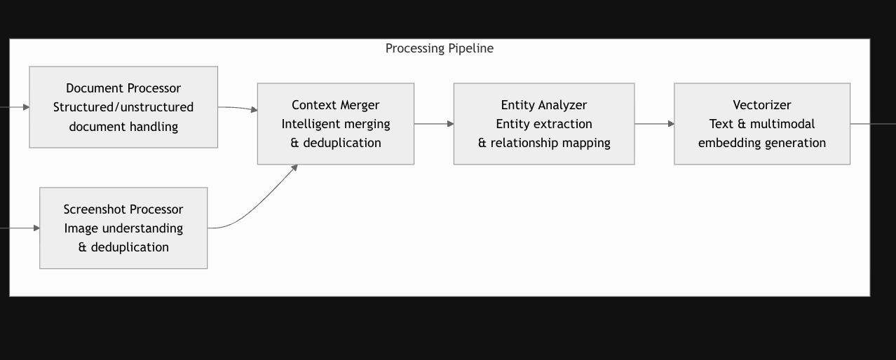
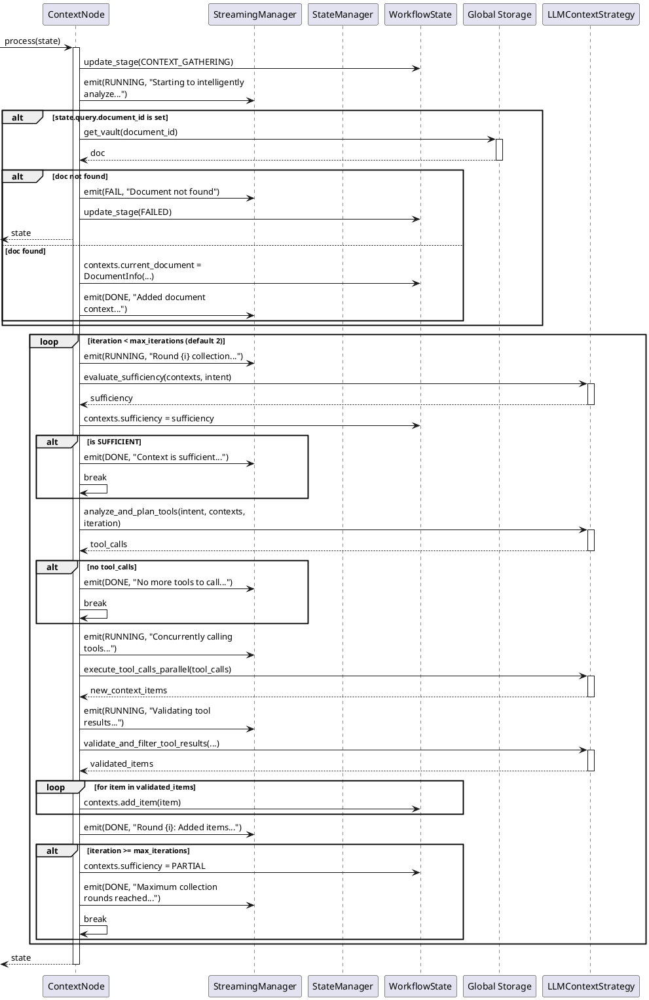

# MineContext 原理分析

## MineContext 是什么？

MineContext 是由火山引擎开源的个人记录助理。其通过后台智能记录用户操作，帮助用户梳理数字活动，提供个性化的回顾和总结。

## MineContext 整体的执行流程

### 数据产生流程

截图 -> 转换 -> 存储

### 数据消费流程

截图 -> Agent -> 查找 -> 总结

## Agent 流程分析

### Intent 流程

### Context 流程

### Execute 流程

### Reflect 流程

## ReAct 模式总结

## Tools Pattern

## 参考资料

## 特殊优化点
- 智能 few shots
