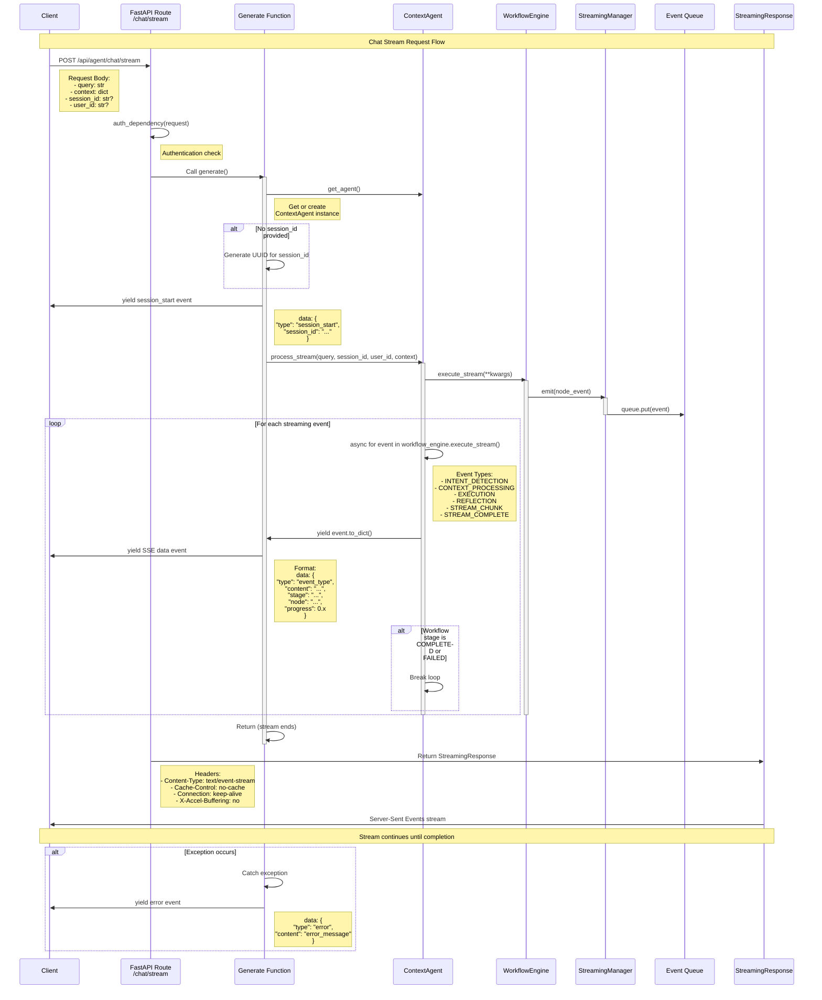

# Chat Stream Sequence Diagram

## Overview
This document contains the Mermaid sequence diagram for the `/api/agent/chat/stream` endpoint, which provides streaming chat functionality in the MineContext application.

## Sequence Diagram



## Event Flow Details

### 1. Request Processing
- The client sends a POST request to `/api/agent/chat/stream` with query parameters
- Request is authenticated via `auth_dependency`
- The route handler creates a generator function for streaming

### 2. Session Management
- If no `session_id` is provided, a new UUID is generated
- A `session_start` event is immediately yielded to the client

### 3. Workflow Execution
- The `ContextAgent.process_stream()` method is called
- This triggers `WorkflowEngine.execute_stream()`
- Events are emitted through the `StreamingManager`

### 4. Event Streaming
- Events are processed in a loop and streamed to the client
- Each event includes:
  - `type`: The event type (e.g., INTENT_DETECTION, CONTEXT_PROCESSING, etc.)
  - `content`: Event message or content
  - `stage`: Current workflow stage
  - `node`: Node type (for node-specific events)
  - `progress`: Progress indicator (0.0-1.0)
  - `metadata`: Additional event data

### 5. Completion
- The stream continues until the workflow reaches `COMPLETED` or `FAILED` stage
- On exception, an error event is streamed
- Response is sent with appropriate SSE headers

## Related Components

### ContextAgent
- Main entry point for processing queries
- Manages workflow engine and streaming manager
- Provides both synchronous `process()` and asynchronous `process_stream()` methods

### WorkflowEngine
- Executes the workflow pipeline
- Generates streaming events during execution
- Manages state across different workflow stages

### StreamingManager
- Handles event emission and queuing
- Provides async event streaming interface
- Manages event buffer for recent events

### StreamEvent
- Unified event representation
- Supports different event types:
  - Workflow events (workflow_start, stage_update, etc.)
  - Node events (intent_detection, context_processing, etc.)
  - Streaming chunks (for LLM output streaming)
  - Completion events (workflow_complete, workflow_failed)

## Usage Example

```javascript
// Client-side JavaScript example
const response = await fetch('/api/agent/chat/stream', {
    method: 'POST',
    headers: {
        'Content-Type': 'application/json',
        'Authorization': 'Bearer <token>'
    },
    body: JSON.stringify({
        query: 'What is the weather like today?',
        context: { location: 'Beijing' },
        session_id: null, // Will be generated
        user_id: 'user123'
    })
});

const reader = response.body.getReader();
const decoder = new TextDecoder();
let buffer = '';

while (true) {
    const { done, value } = await reader.read();
    if (done) break;

    buffer += decoder.decode(value, { stream: true });
    const lines = buffer.split('\n');
    buffer = lines.pop(); // Keep incomplete line in buffer

    for (const line of lines) {
        if (line.startsWith('data: ')) {
            const event = JSON.parse(line.slice(6));
            console.log('Received event:', event);

            // Handle different event types
            switch(event.type) {
                case 'session_start':
                    console.log('Session started:', event.session_id);
                    break;
                case 'intent_detection':
                    console.log('Intent detected:', event.content);
                    break;
                case 'stream_chunk':
                    console.log('Content chunk:', event.content);
                    break;
                case 'workflow_complete':
                    console.log('Workflow completed');
                    break;
                case 'error':
                    console.error('Error:', event.content);
                    break;
            }
        }
    }
}
```

## Error Handling

The streaming endpoint handles errors by:
1. Catching exceptions in the generator function
2. Logging the exception details
3. Streaming an error event to the client
4. Closing the stream

Error events have the format:
```json
{
    "type": "error",
    "content": "Error message details"
}
```

## HTTP Headers

The response includes the following headers for proper SSE handling:
- `Content-Type: text/event-stream`
- `Cache-Control: no-cache`
- `Connection: keep-alive`
- `X-Accel-Buffering: no` (for Nginx)

## Advantages of Streaming Architecture

1. **Real-time Feedback**: Users see progress as the workflow executes
2. **Better UX**: No waiting for complete response
3. **Incremental Updates**: Events can be processed as they arrive
4. **Error Transparency**: Errors are streamed immediately
5. **Progress Tracking**: Progress events provide execution status

## Performance Considerations

- Event queue has a max size of 1000 to prevent memory issues
- Events are streamed with minimal latency
- Each event is JSON-serialized before sending
- The stream auto-terminates on workflow completion or failure
