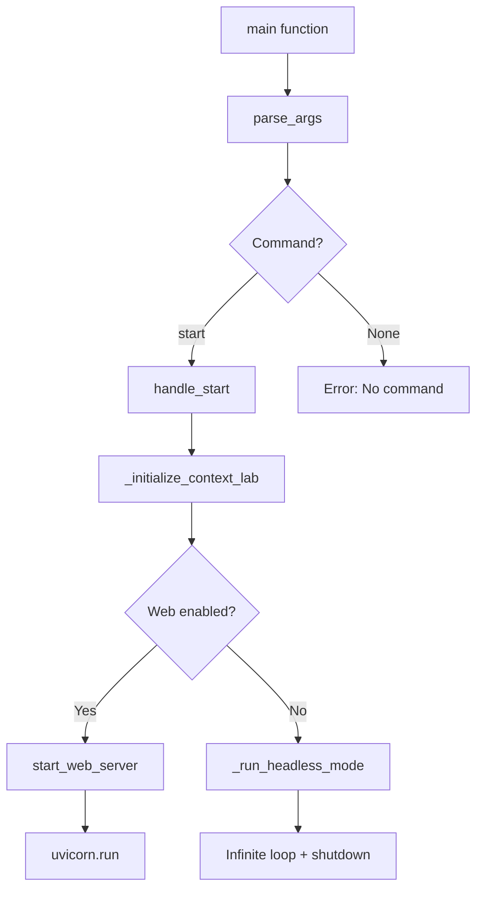
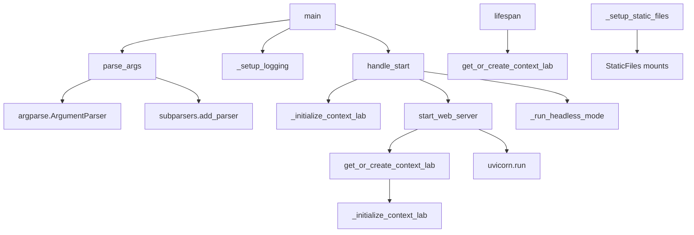
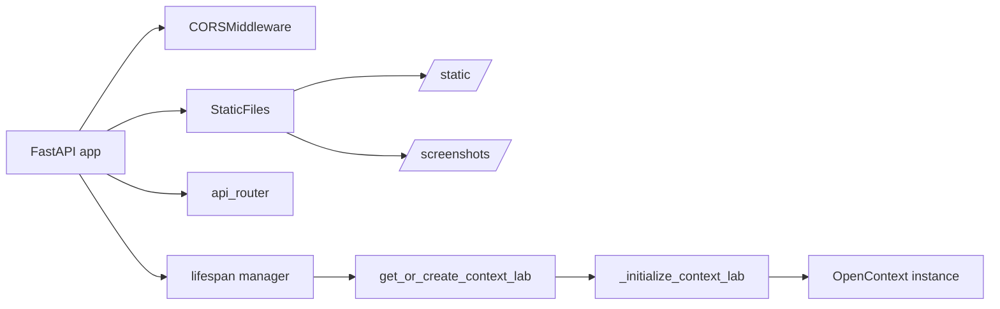
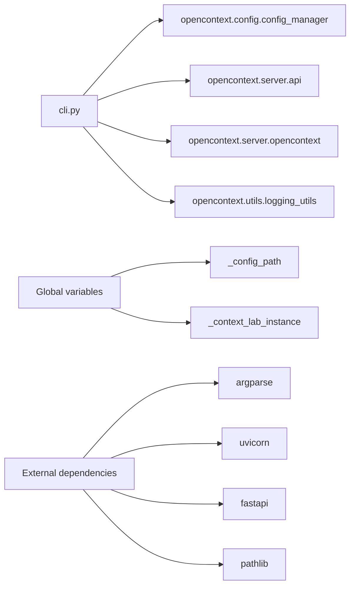
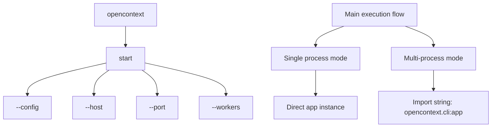
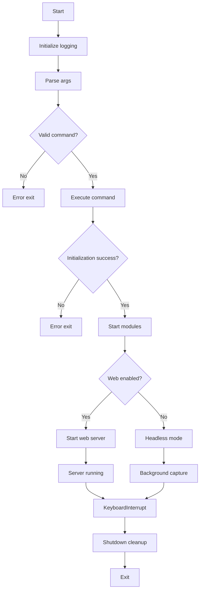

# OpenContext CLI Structure Diagrams

This document contains Mermaid diagrams that illustrate the structure and architecture of the `opencontext/cli.py` file.

## 1. Main Function Flow Diagram

Shows the execution path from command line to server startup:

## 2. Function Hierarchy Diagram

Displays the relationships between different functions:

## 3. FastAPI Application Structure

Illustrates the web application components:

## 4. Configuration and Dependencies

Shows internal and external dependencies:

## 5. Command Line Interface Structure

Details the command line interface options:

## 6. Error Handling and Lifecycle

Shows the error handling and lifecycle management:

## Key Components Explained

### Main Entry Point
- `main()`: Primary entry function that orchestrates the entire startup process
- `parse_args()`: Handles command line argument parsing with subcommands

### Application Initialization
- `_initialize_context_lab()`: Creates and initializes the OpenContext instance
- `_setup_logging()`: Configures logging based on configuration files
- `_setup_static_files()`: Mounts static file directories for the web server

### Web Server Management
- `start_web_server()`: Starts the uvicorn web server in single or multi-process mode
- `lifespan()`: FastAPI lifespan manager for startup/shutdown hooks
- `get_or_create_context_lab()`: Singleton pattern for OpenContext instance

### Operation Modes
- **Web Server Mode**: Full web interface with API endpoints
- **Headless Mode**: Background operation without web interface

### Configuration
- Supports configuration file override via `--config` parameter
- Command line arguments take precedence over configuration file settings
- Multi-process support for production deployments

This CLI serves as the main entry point for the OpenContext system, providing both web server and headless operation modes with proper configuration management and error handling.