# MineContext Core Workflows Documentation

This document provides a comprehensive overview of the core workflows in MineContext, an open-source, proactive context-aware AI partner.

## System Overview

MineContext is built around a **context engineering architecture** that supports the complete lifecycle of multimodal, multi-source data—from capture, processing, and storage to management, retrieval, and consumption.

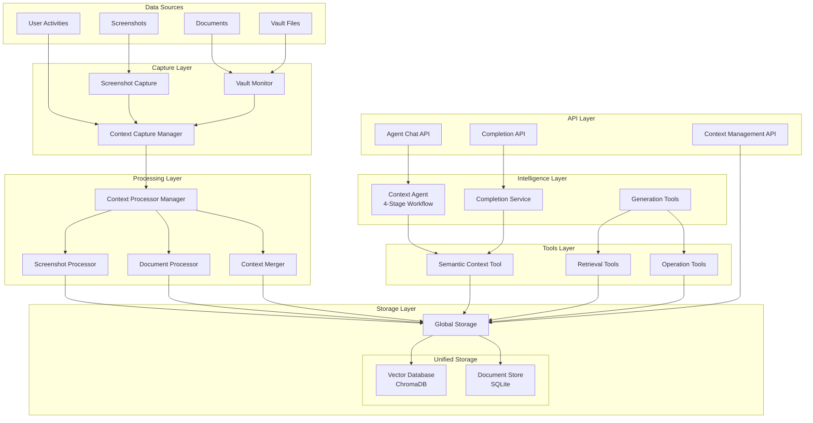

## Architecture Deep Dive

### Context Agent 4-Stage Workflow

The Context Agent implements a sophisticated 4-stage workflow engine that processes queries through distinct phases:

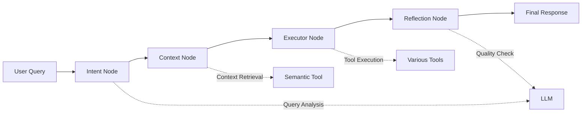

**Stage 1: Intent Node**
- Analyzes user query type and requirements
- Enhances query with semantic understanding
- Determines workflow path

**Stage 2: Context Node**
- Retrieves relevant context via SemanticContextTool
- Queries vector database for similar content
- Gathers contextual information for execution

**Stage 3: Executor Node**
- Executes appropriate tools from the tools ecosystem
- Includes retrieval, profile, and operation tools
- Performs the actual work requested

**Stage 4: Reflection Node**
- Evaluates response quality
- Checks for completeness and accuracy
- Can trigger additional processing if needed

### Tools Ecosystem

The intelligence layer connects to storage through a comprehensive tools system:

**Retrieval Tools:**
- `SemanticContextTool` - Vector search through ChromaDB
- `ActivityContextTool` - User activity queries from SQLite
- `StateContextTool` - Document state retrieval

**Profile Tools:**
- User preference and behavior analysis
- Personalization data access

**Operation Tools:**
- External web search
- Data manipulation operations

## Core Workflow Categories

### 1. Context Capture Workflows

These workflows handle the collection of raw context data from various sources.

#### 1.1 Screenshot Capture Workflow
**Route**: `/api/add_screenshot`
**Purpose**: Automatically capture and process user desktop screenshots

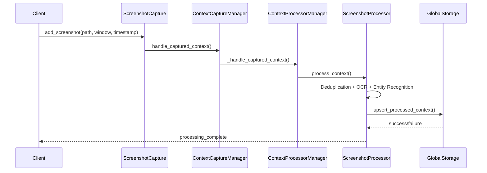

#### 1.2 Document Upload Workflow
**Route**: `/api/documents/upload`
**Purpose**: Process uploaded documents for context extraction

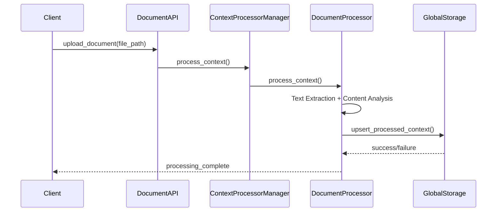

#### 1.3 Vault Monitoring Workflow
**Component**: `VaultDocumentMonitor`
**Purpose**: Automatically monitor and process document vault changes

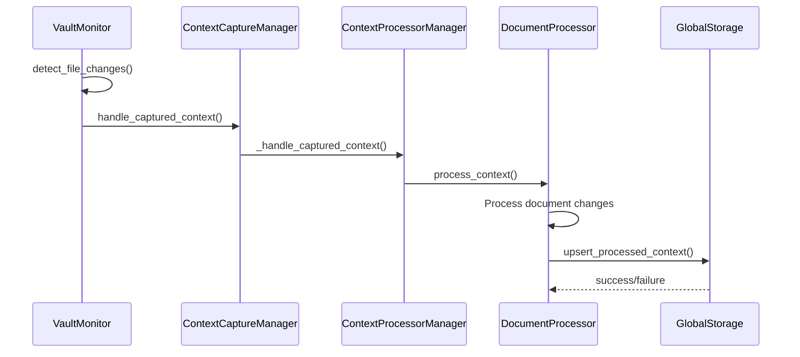

### 2. Context Processing Workflows

These workflows transform raw data into structured, searchable context.

#### 2.1 Content Processing Pipeline

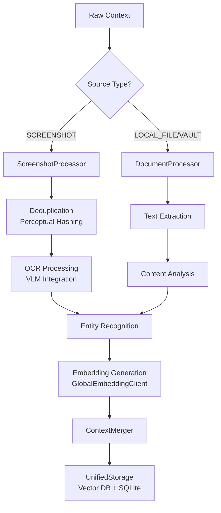

#### 2.2 Context Processor Manager Workflow

**Component**: `ContextProcessorManager`
**Purpose**: Route and manage context processing through callback architecture

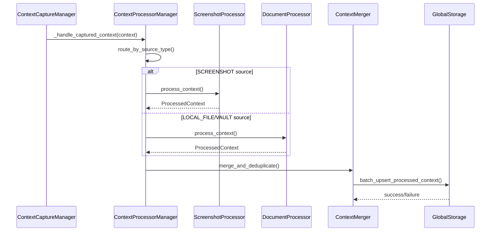

### 3. Context Consumption Workflows

These workflows enable intelligent consumption of stored context.

#### 3.1 Context Agent 4-Stage Workflow
**Route**: `/api/agent/chat`
**Purpose**: AI-powered chat with sophisticated multi-stage reasoning

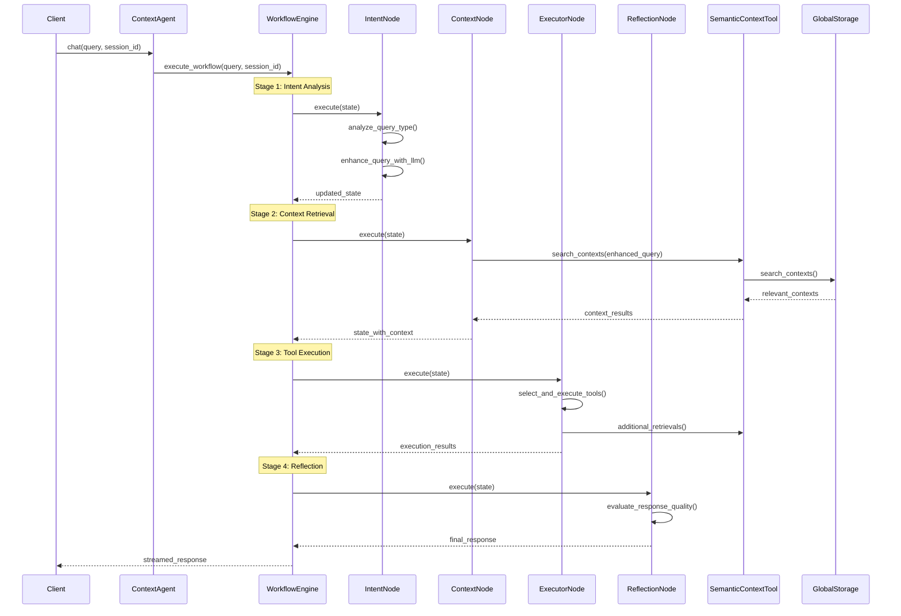

#### 3.2 Completion Service Workflow
**Route**: `/api/completions/suggest`
**Purpose**: GitHub Copilot-like intelligent completion suggestions

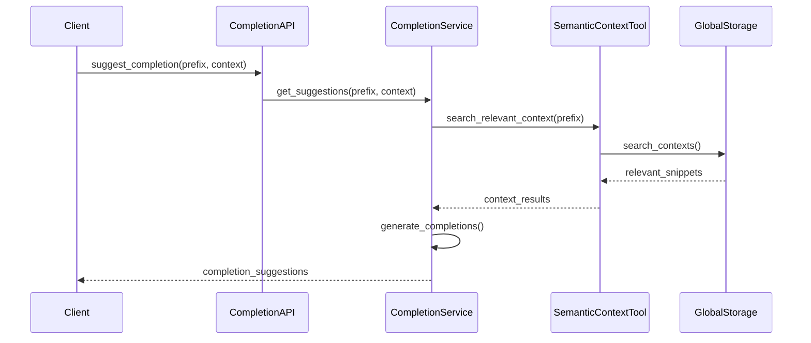

#### 3.3 Streaming Chat Workflow
**Route**: `/api/agent/chat` with streaming enabled
**Purpose**: Real-time streaming responses for interactive chat

Key features:
- **Real-time Events**: Streaming of thinking, processing, and response events
- **Progress Tracking**: Live progress updates during context gathering
- **Session Management**: Maintains conversation state across interactions

#### 3.4 Workflow Resume Workflow
**Route**: `/api/agent/resume`
**Purpose**: Resume interrupted workflows or provide additional input

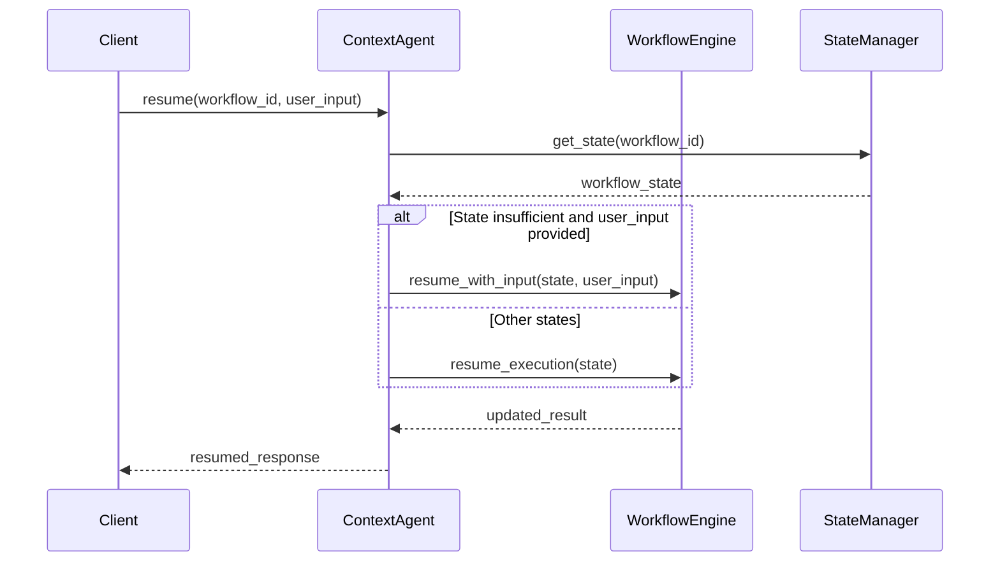

### 4. Intelligent Completion Workflows

These workflows provide GitHub Copilot-like intelligent completion capabilities.

#### 4.1 Smart Completion Workflow
**Route**: `/api/completions`
**Purpose**: Context-aware code and text completion

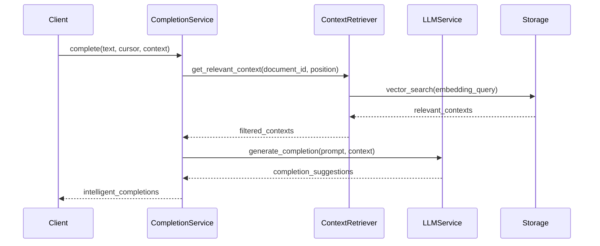

#### 4.2 Context-Aware Completion Types

1. **Semantic Continuation**: Continue writing based on semantic understanding
2. **Template Completion**: Suggest relevant templates and patterns
3. **Context-Aware Code**: Code suggestions based on project context
4. **Document Enhancement**: Enhance existing content with relevant information

### 5. Context Management Workflows

These workflows handle the management and organization of stored context.

#### 5.1 Context Query and Retrieval Workflow
**Route**: `/api/context/query`
**Purpose**: Search and retrieve stored context

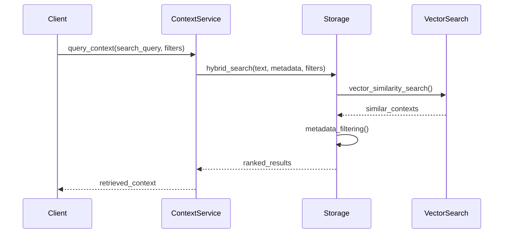

#### 5.2 Context Update Workflow
**Route**: `/api/context/{context_id}`
**Purpose**: Update and manage existing context

Features:
- **Metadata Updates**: Update titles, summaries, keywords
- **Content Enhancement**: Improve context quality
- **Relationship Management**: Update context relationships
- **Version Control**: Track context changes over time

### 6. Generation and Analysis Workflows

These workflows generate insights and analysis from collected context.

#### 6.1 Daily Summary Workflow
**Purpose**: Generate daily activity summaries

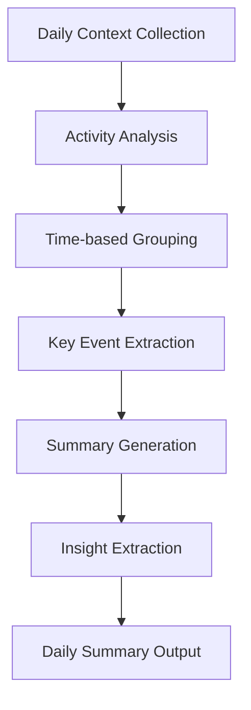

#### 6.2 Smart Tip Generation Workflow
**Purpose**: Generate actionable tips and insights

Key features:
- **Pattern Recognition**: Identify productivity patterns
- **Recommendation Engine**: Suggest improvements
- **Contextual Tips**: Provide relevant advice based on current activities

#### 6.3 Todo Management Workflow
**Purpose**: Intelligent todo list management

Features:
- **Automated Task Extraction**: Extract tasks from context
- **Priority Ranking**: Prioritize based on context and deadlines
- **Progress Tracking**: Monitor completion status
- **Smart Reminders**: Context-aware reminders

### 7. Monitoring and Maintenance Workflows

These workflows ensure system health and performance.

#### 7.1 Health Monitoring Workflow
**Purpose**: System health checks and monitoring

Components:
- **Component Health**: Monitor individual component status
- **Performance Metrics**: Track processing times and throughput
- **Error Tracking**: Monitor and alert on errors
- **Resource Usage**: Track memory, CPU, storage usage

#### 7.2 Data Maintenance Workflow
**Purpose**: Data cleanup and optimization

Tasks:
- **Expired Data Cleanup**: Remove old or irrelevant data
- **Index Optimization**: Optimize search indices
- **Storage Management**: Manage storage usage
- **Backup Operations**: Regular data backups

## Workflow Integration and Orchestration

### Central Orchestrator: OpenContext Class

The `OpenContext` class serves as the central orchestrator that coordinates all workflows:

```python
class OpenContext:
    def __init__(self):
        self.capture_manager = ContextCaptureManager()
        self.processor_manager = ContextProcessorManager()
        self.consumption_manager = ConsumptionManager()
        self.workflow_engine = None  # Agent-based workflow
        self.completion_service = None
```

### Workflow Dependencies

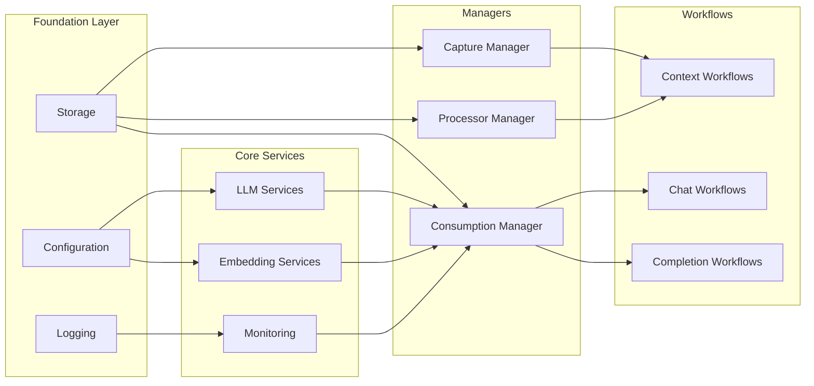

## Key Workflow Characteristics

### 1. **Async and Streaming First**
- All major workflows support async processing
- Streaming responses for real-time interaction
- Non-blocking operations for better performance

### 2. **Context-Aware Intelligence**
- Workflows leverage stored context for intelligence
- Multi-modal context integration
- Semantic understanding and relevance matching

### 3. **Fault Tolerance and Recovery**
- Robust error handling throughout workflows
- Automatic retry mechanisms
- Graceful degradation when components fail

### 4. **Scalable Architecture**
- Modular workflow design
- Horizontal scaling capabilities
- Resource management and optimization

### 5. **Privacy and Security**
- Local-first data storage
- Secure processing pipelines
- User data protection

## Workflow Configuration

### Configuration Management
Workflows are configured through a hierarchical configuration system:

```yaml
# config/config.yaml
chat_workflow:
  intent_analysis:
    enabled: true
    model: "gpt-4"
  context_collection:
    max_iterations: 3
    tools_enabled: ["document_search", "web_search"]
  execution:
    streaming: true
    max_tokens: 4000

completion_service:
  enabled: true
  context_window: 8000
  max_suggestions: 3

monitoring:
  enabled: true
  metrics_interval: 60
```

### Runtime Configuration
- Dynamic configuration updates
- Environment-specific settings
- Feature flags for experimental features

## Performance and Optimization

### Workflow Optimization Strategies

1. **Caching**: Intelligent caching of frequently accessed context
2. **Batching**: Batch processing for improved throughput
3. **Parallel Processing**: Concurrent execution where possible
4. **Resource Management**: Efficient resource allocation
5. **Query Optimization**: Optimized context retrieval queries

### Monitoring and Metrics

Key workflow metrics:
- **Processing Time**: Time for each workflow stage
- **Success Rate**: Success/failure ratios
- **Context Quality**: Relevance and usefulness scores
- **User Satisfaction**: Feedback and usage patterns

## Future Workflow Enhancements

### Planned Improvements

1. **Multi-modal Context**: Enhanced support for images, videos, audio
2. **Real-time Collaboration**: Multi-user workflow support
3. **Advanced Analytics**: More sophisticated analysis capabilities
4. **Custom Workflow Engine**: User-defined workflow capabilities
5. **Integration Hub**: Third-party service integrations

### Extensibility

The workflow system is designed for extensibility:
- **Plugin Architecture**: Easy addition of new workflow components
- **API Extensions**: RESTful APIs for all workflows
- **Custom Processors**: User-defined context processors
- **Workflow Templates**: Reusable workflow patterns

This comprehensive workflow ecosystem enables MineContext to provide intelligent, context-aware assistance throughout the user's digital workspace, transforming raw data into actionable insights and automated assistance.