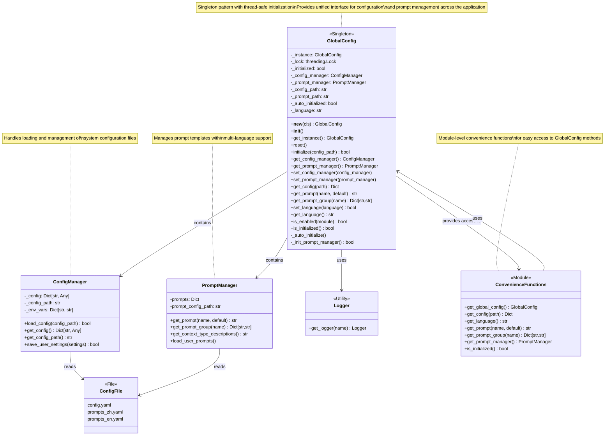

# GlobalConfig Architecture Documentation

## Overview

The `GlobalConfig` class is a singleton configuration manager that provides a unified interface for accessing system configurations and prompt templates throughout the OpenContext application. It serves as a central hub for configuration management, ensuring consistent access to settings and prompts across all components.

## Architecture Diagram



## Core Components

### GlobalConfig (Singleton)

**Purpose:** Central configuration manager implementing the singleton pattern.

**Key Features:**
- Thread-safe singleton implementation using double-checked locking
- Automatic initialization with default configuration paths
- Manages both system configuration and prompt templates
- Supports multi-language prompts (Chinese/English)

**Class Attributes:**
- `_instance`: Singleton instance reference
- `_lock`: Thread safety lock for singleton creation
- `_initialized`: Initialization status flag
- `_config_manager`: Configuration manager instance
- `_prompt_manager`: Prompt manager instance
- `_config_path`: Path to configuration file
- `_prompt_path`: Path to prompt file
- `_auto_initialized`: Auto-initialization flag
- `_language`: Current language setting

**Magic Methods:**
- `__new__(cls)`: Implements singleton pattern with thread-safe double-checked locking
- `__init__()`: Initializes instance attributes only once, preventing re-initialization

**Public Methods:**
- `get_instance()`: Returns singleton instance with auto-initialization if needed
- `initialize(config_path)`: Manually initialize configuration and prompt managers
- `reset()`: Reset singleton state (primarily for testing)
- `get_config_manager()`: Get the configuration manager instance
- `get_prompt_manager()`: Get the prompt manager instance
- `set_config_manager(config_manager)`: Set configuration manager (backward compatibility)
- `set_prompt_manager(prompt_manager)`: Set prompt manager (backward compatibility)
- `get_config(path)`: Access configuration by dot-notation path
- `get_prompt(name, default)`: Access prompt by name with optional default
- `get_prompt_group(name)`: Get a group of related prompts
- `set_language(language)`: Switch language and reload prompts
- `get_language()`: Get current language setting
- `is_enabled(module)`: Check if a module is enabled in configuration
- `is_initialized()`: Check if global configuration is initialized

**Private Methods:**
- `_auto_initialize()`: Automatically initialize with default configuration paths
- `_init_prompt_manager()`: Initialize prompt manager based on config language setting

### ConfigManager

**Purpose:** Handles loading and management of system configuration files.

**Responsibilities:**
- Load YAML configuration files
- Parse and store configuration data
- Provide access to configuration values
- Support environment variable substitution
- Save user settings

**File Structure:**
- Primary config: `config/config.yaml`
- Supports dot-notation access (e.g., "database.connection")

### PromptManager

**Purpose:** Manages prompt templates with multi-language support.

**Features:**
- Load prompt templates from YAML files
- Support for grouped prompts
- Multi-language support (zh/en)
- User prompt customization
- Context type descriptions

**File Structure:**
- Chinese prompts: `prompts_zh.yaml`
- English prompts: `prompts_en.yaml`

### Convenience Functions

**Purpose:** Module-level functions provide easy access without explicit GlobalConfig calls.

**Available Functions:**
- `get_global_config()`: Get GlobalConfig instance
- `get_config(path)`: Get configuration value
- `get_language()`: Get current language
- `get_prompt(name)`: Get prompt by name
- `get_prompt_group(name)`: Get prompt group
- `get_prompt_manager()`: Get PromptManager instance
- `is_initialized()`: Check initialization status

## Design Patterns

### 1. Singleton Pattern
Ensures only one instance of GlobalConfig exists throughout the application lifecycle.

```python
@classmethod
def get_instance(cls) -> "GlobalConfig":
    instance = cls()
    if not instance._auto_initialized and instance._config_manager is None:
        instance._auto_initialize()
    return instance
```

### 2. Facade Pattern
GlobalConfig provides a simplified interface to complex subsystems (ConfigManager + PromptManager).

### 3. Composition Pattern
GlobalConfig contains and manages ConfigManager and PromptManager instances.

### 4. Thread-Safe Initialization
Uses double-checked locking with threading.Lock() for safe singleton creation.

## Private Methods Implementation

### `_auto_initialize()`

**Purpose:** Automatically initializes the GlobalConfig with default configuration paths when first accessed.

**Behavior:**
- Checks if auto-initialization has already occurred to prevent repeated attempts
- Attempts to load configuration from "config/config.yaml"
- Sets initialization flag to prevent repeated failed attempts
- Handles errors gracefully with logging

```python
def _auto_initialize(self):
    if self._auto_initialized:
        return

    try:
        self._initialized = self.initialize("config/config.yaml")
        if not self._initialized:
            logger.error("GlobalConfig auto-initialization: no config file found, using defaults")
        self._auto_initialized = True
    except Exception as e:
        logger.error(f"GlobalConfig auto-initialization failed: {e}")
        self._auto_initialized = True  # Prevent repeated attempts
```

### `_init_prompt_manager()`

**Purpose:** Initializes the PromptManager based on the configuration language setting.

**Behavior:**
- Validates that ConfigManager is available and loaded
- Extracts language preference from configuration (defaults to "zh")
- Constructs prompt file path based on language (e.g., "prompts_zh.yaml")
- Validates prompt file existence before loading
- Creates PromptManager instance and loads user prompts

```python
def _init_prompt_manager(self) -> bool:
    if not self._config_manager:
        logger.warning("Config manager not initialized, cannot load prompts")
        return False

    config = self._config_manager.get_config()
    if not config:
        logger.warning("No configuration available for prompts")
        return False

    prompts_config = config.get("prompts", {})
    language = prompts_config.get("language", "zh")
    prompts_path = f"prompts_{language}.yaml"

    base_dir = os.path.dirname(self._config_path)
    absolute_prompts_path = os.path.join(base_dir, prompts_path)

    # ... validation and loading logic ...
```

## Magic Methods Implementation

### `__new__(cls)`

**Purpose:** Implements thread-safe singleton pattern using double-checked locking.

**Behavior:**
- Checks if singleton instance exists
- Uses thread lock to ensure thread safety
- Creates new instance only if none exists
- Returns existing instance for subsequent calls

```python
def __new__(cls):
    if cls._instance is None:
        with cls._lock:
            if cls._instance is None:
                cls._instance = super().__new__(cls)
    return cls._instance
```

### `__init__()`

**Purpose:** Initializes instance attributes only once, preventing re-initialization.

**Behavior:**
- Checks initialization flag to prevent re-initialization
- Uses thread lock for safety during initialization
- Sets up instance attributes to None/uninitialized states
- Marks class as initialized to prevent further initialization attempts

## Usage Examples

### Basic Usage
```python
from opencontext.config.global_config import get_config, get_prompt

# Get configuration value
db_config = get_config("database.connection")
api_key = get_config("services.openai.api_key")

# Get prompt template
welcome_prompt = get_prompt("welcome.message")
error_prompt = get_prompt("errors.timeout", "Default timeout error")
```

### Advanced Usage
```python
from opencontext.config.global_config import GlobalConfig

# Get singleton instance
global_config = GlobalConfig.get_instance()

# Language switching
global_config.set_language("en")

# Check module status
if global_config.is_enabled("search"):
    # Search functionality is enabled
    pass

# Access managers directly
config_manager = global_config.get_config_manager()
prompt_manager = global_config.get_prompt_manager()
```

## Initialization Flow

1. **Auto-initialization**: When `get_instance()` is first called, GlobalConfig attempts to auto-initialize
2. **Config Loading**: Tries to load `config/config.yaml` from default location
3. **Prompt Loading**: Based on language setting in config, loads appropriate prompt file
4. **Fallback**: If auto-initialization fails, returns uninitialized instance with default behavior

## Configuration Files Structure

### config.yaml
```yaml
# System configuration
database:
  connection: "sqlite:///data.db"

services:
  openai:
    api_key: "${OPENAI_API_KEY}"

prompts:
  language: "zh"  # or "en"

# Module settings
search:
  enabled: true
  timeout: 30
```

### prompts_zh.yaml / prompts_en.yaml
```yaml
welcome:
  message: "欢迎使用系统"

errors:
  timeout: "请求超时，请稍后重试"

prompts:
  summarization: "请总结以下内容：{content}"
```

## Thread Safety

The GlobalConfig implementation ensures thread safety through:

1. **Singleton Creation**: Double-checked locking with threading.Lock()
2. **Initialization**: Protected initialization with lock guards
3. **State Management**: Atomic operations for state changes

## Error Handling

- Graceful fallback when configuration files are missing
- Default values for prompts and settings
- Comprehensive logging of initialization and runtime errors
- Validation for language settings and file paths

## Testing Considerations

- Use `reset()` method to clean singleton state between tests
- Mock file system for configuration loading tests
- Test thread safety with concurrent access patterns

## Performance Considerations

- Lazy initialization: Only loads configuration when first accessed
- Singleton pattern: Single instance reduces memory footprint
- Caching: Configuration data is cached in memory for fast access

## Best Practices

1. **Use convenience functions** for simple access patterns
2. **Handle None returns** when configuration might be missing
3. **Validate language settings** before calling set_language()
4. **Use dot-notation** for nested configuration access
5. **Test reset functionality** when writing unit tests

## Dependencies

- **threading**: For thread-safe singleton implementation
- **pathlib**: For file path handling
- **ConfigManager**: Configuration file management
- **PromptManager**: Prompt template management
- **logging_utils**: Logging functionality

## File Locations

- **Main implementation**: `opencontext/config/global_config.py`
- **ConfigManager**: `opencontext/config/config_manager.py`
- **PromptManager**: `opencontext/config/prompt_manager.py`
- **Configuration files**: `config/config.yaml`
- **Prompt files**: `config/prompts_{language}.yaml`