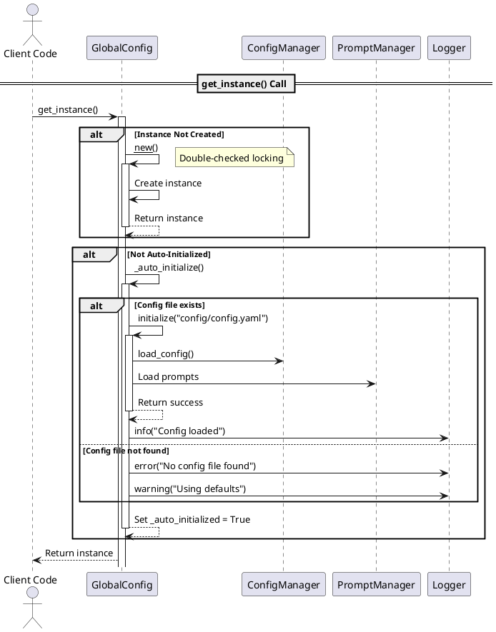
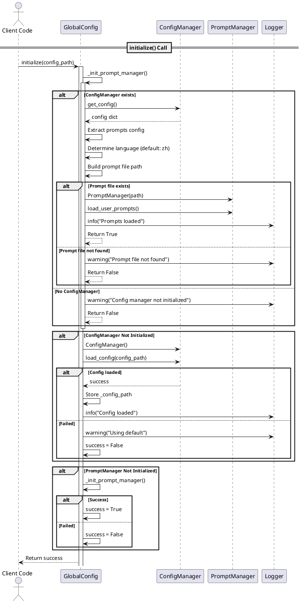
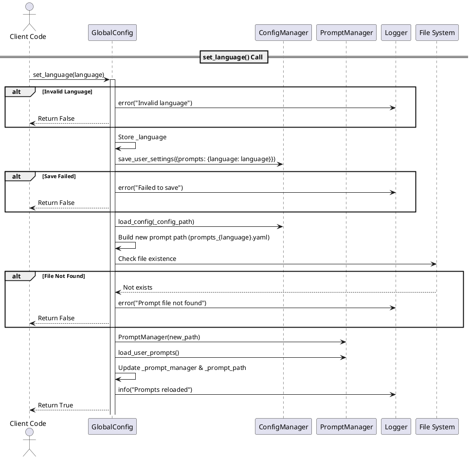
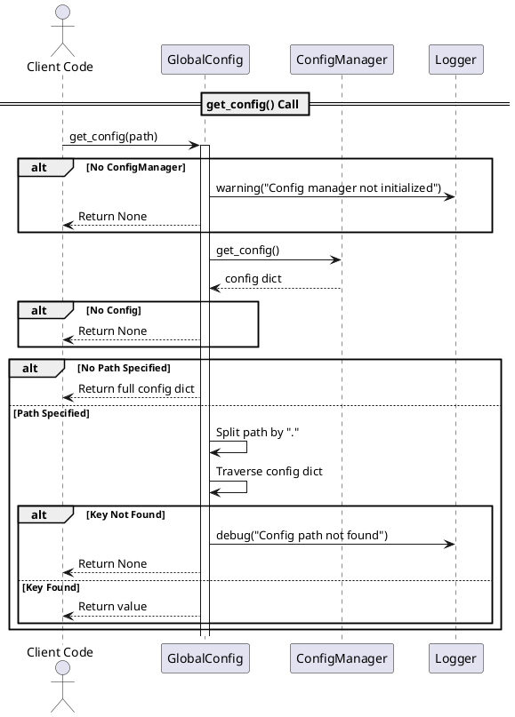
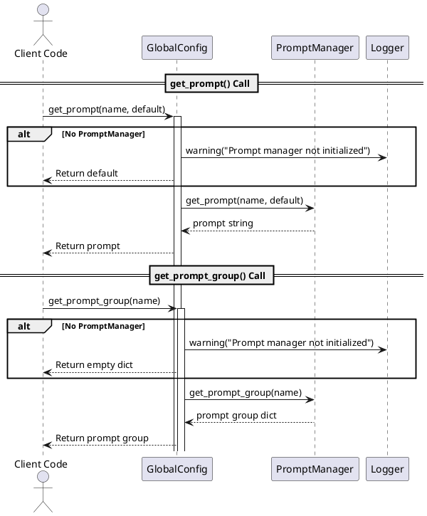
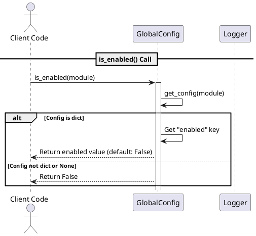
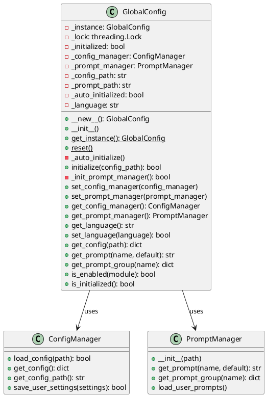
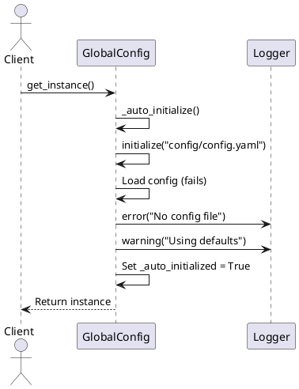
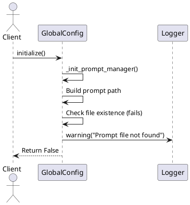
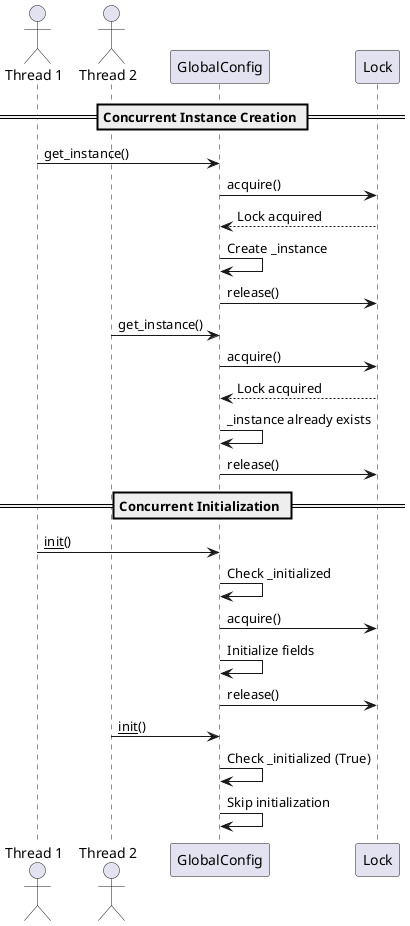

# GlobalConfig Workflows Documentation

## Overview

The `GlobalConfig` class is a singleton-based global configuration manager that provides a unified interface for accessing configurations and prompts across the entire application. This document describes the main workflows using PlantUML sequence diagrams.

## Architecture

### 1. Singleton Creation and Instance Retrieval Workflow

This diagram shows how the singleton pattern ensures only one instance exists and how auto-initialization works when `get_instance()` is called.



**Key Points:**
- Uses double-checked locking pattern in `__new__()` for thread-safe singleton creation
- Auto-initializes on first `get_instance()` call if not already initialized
- Attempts to load `config/config.yaml` by default
- Falls back to default configuration if file not found

### 2. Manual Initialization Workflow

This diagram shows the detailed initialization process when `initialize()` is called explicitly.



**Key Points:**
- Initializes both `ConfigManager` and `PromptManager`
- ConfigManager loads configuration from YAML file
- PromptManager loads language-specific prompts (e.g., `prompts_zh.yaml`)
- Also loads user-customized prompts if available

### 3. Language Change Workflow

This diagram shows the process of changing the language setting and reloading prompts.



**Key Points:**
- Validates language code (only "zh" or "en" supported)
- Persists language setting to user settings
- Reloads configuration to pick up new language
- Reloads prompts from language-specific file
- Loads user-customized prompts

### 4. Configuration Access Workflow

This diagram shows how configuration values are retrieved using path-based access.



**Key Points:**
- Supports nested configuration access using dot notation (e.g., "database.host")
- Returns full config dict if no path specified
- Returns None for missing paths

### 5. Prompt Access Workflow

This diagram shows how prompts and prompt groups are retrieved.



**Key Points:**
- Returns default value if prompt manager not initialized
- Prompt groups return dictionaries of related prompts
- Empty dict returned for missing prompt groups

### 6. Module Check Workflow

This diagram shows how to check if a module is enabled.



**Key Points:**
- Checks if a module configuration exists and has "enabled" set to true
- Returns false for missing or invalid module configs

## Key Features

### Thread Safety
- Uses double-checked locking pattern for singleton creation
- Lock-based initialization to prevent race conditions

### Auto-Initialization
- Automatically attempts to initialize on first use
- Falls back to defaults if config file not found

### Error Handling
- Graceful degradation when configuration files are missing
- Comprehensive logging for debugging
- Default values returned when managers not initialized

### Backward Compatibility
- Setter methods for manual manager injection
- Convenience functions for common operations

## Usage Examples

### Basic Usage

```python
from opencontext.config.global_config import GlobalConfig

# Get the singleton instance (auto-initializes)
config = GlobalConfig.get_instance()

# Access configuration
api_key = config.get_config("openai.api_key")
database_host = config.get_config("database.host")

# Check if module is enabled
if config.is_enabled("openai"):
    # Use OpenAI features
    pass

# Get a prompt
default_prompt = config.get_prompt("default", "Default prompt text")

# Get a prompt group
openai_prompts = config.get_prompt_group("openai")
```

### Language Switching

```python
# Change language (reloads prompts)
if config.set_language("en"):
    print("Language changed to English")
else:
    print("Failed to change language")
```

### Using Convenience Functions

```python
from opencontext.config.global_config import (
    get_config, get_prompt, get_language, is_initialized
)

# Direct access without getting instance
api_key = get_config("openai.api_key")
prompt = get_prompt("default")
language = get_language()
```

## Class Structure



## Error Scenarios

### Missing Configuration File



### Missing Prompt File



## Thread Safety Mechanism



**Key Points:**
- Double-checked locking prevents multiple instance creation
- Initialization lock prevents race conditions during setup
- Check flags prevent re-initialization

## Related Files

- `opencontext/config/config_manager.py` - Configuration file management
- `opencontext/config/prompt_manager.py` - Prompt file management
- `config/config.yaml` - Main configuration file
- `config/prompts_zh.yaml` - Chinese prompts
- `config/prompts_en.yaml` - English prompts
