# WorkflowState Class Diagrams

This document contains Mermaid class diagrams for the WorkflowState system and related components.

## Main WorkflowState Diagram

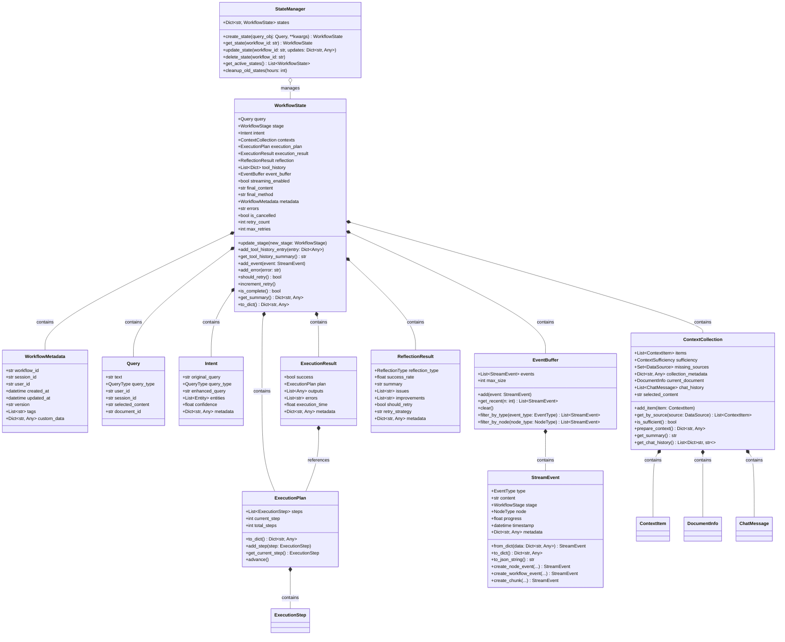
```mermaid
classDiagram
    class WorkflowState {
        +Query query
        +WorkflowStage stage
        +Intent intent
        +ContextCollection contexts
        +ExecutionPlan execution_plan
        +ExecutionResult execution_result
        +ReflectionResult reflection
        +List~Dict~ tool_history
        +EventBuffer event_buffer
        +bool streaming_enabled
        +str final_content
        +str final_method
        +WorkflowMetadata metadata
        +str errors
        +bool is_cancelled
        +int retry_count
        +int max_retries
        +update_stage(new_stage: WorkflowStage)
        +add_tool_history_entry(entry: Dict~Any~)
        +get_tool_history_summary() str
        +add_event(event: StreamEvent)
        +add_error(error: str)
        +should_retry() bool
        +increment_retry()
        +is_complete() bool
        +get_summary() Dict~str, Any~
        +to_dict() Dict~str, Any~
    }

    class WorkflowMetadata {
        +str workflow_id
        +str session_id
        +str user_id
        +datetime created_at
        +datetime updated_at
        +str version
        +List~str~ tags
        +Dict~str, Any~ custom_data
    }

    class StateManager {
        +Dict~str, WorkflowState~ states
        +create_state(query_obj: Query, **kwargs) WorkflowState
        +get_state(workflow_id: str) WorkflowState
        +update_state(workflow_id: str, updates: Dict~str, Any~)
        +delete_state(workflow_id: str)
        +get_active_states() List~WorkflowState~
        +cleanup_old_states(hours: int)
    }

    class Query {
        +str text
        +QueryType query_type
        +str user_id
        +str session_id
        +str selected_content
        +str document_id
    }

    class Intent {
        +str original_query
        +QueryType query_type
        +str enhanced_query
        +List~Entity~ entities
        +float confidence
        +Dict~str, Any~ metadata
    }

    class ContextCollection {
        +List~ContextItem~ items
        +ContextSufficiency sufficiency
        +Set~DataSource~ missing_sources
        +Dict~str, Any~ collection_metadata
        +DocumentInfo current_document
        +List~ChatMessage~ chat_history
        +str selected_content
        +add_item(item: ContextItem)
        +get_by_source(source: DataSource) List~ContextItem~
        +is_sufficient() bool
        +prepare_context() Dict~str, Any~
        +get_summary() str
        +get_chat_history() List~Dict~str, str~~
    }

    class ExecutionPlan {
        +List~ExecutionStep~ steps
        +int current_step
        +int total_steps
        +to_dict() Dict~str, Any~
        +add_step(step: ExecutionStep)
        +get_current_step() ExecutionStep
        +advance()
    }

    class ExecutionResult {
        +bool success
        +ExecutionPlan plan
        +List~Any~ outputs
        +List~str~ errors
        +float execution_time
        +Dict~str, Any~ metadata
    }

    class ReflectionResult {
        +ReflectionType reflection_type
        +float success_rate
        +str summary
        +List~str~ issues
        +List~str~ improvements
        +bool should_retry
        +str retry_strategy
        +Dict~str, Any~ metadata
    }

    class EventBuffer {
        +List~StreamEvent~ events
        +int max_size
        +add(event: StreamEvent)
        +get_recent(n: int) List~StreamEvent~
        +clear()
        +filter_by_type(event_type: EventType) List~StreamEvent~
        +filter_by_node(node_type: NodeType) List~StreamEvent~
    }

    class StreamEvent {
        +EventType type
        +str content
        +WorkflowStage stage
        +NodeType node
        +float progress
        +datetime timestamp
        +Dict~str, Any~ metadata
        +from_dict(data: Dict~str, Any~) StreamEvent
        +to_dict() Dict~str, Any~
        +to_json_string() str
        +create_node_event(...) StreamEvent
        +create_workflow_event(...) StreamEvent
        +create_chunk(...) StreamEvent
    }

    WorkflowState *-- WorkflowMetadata : contains
    WorkflowState *-- Query : contains
    WorkflowState *-- Intent : contains
    WorkflowState *-- ContextCollection : contains
    WorkflowState *-- ExecutionPlan : contains
    WorkflowState *-- ExecutionResult : contains
    WorkflowState *-- ReflectionResult : contains
    WorkflowState *-- EventBuffer : contains
    StateManager o-- WorkflowState : manages
    ContextCollection *-- ContextItem : contains
    ContextCollection *-- DocumentInfo : contains
    ContextCollection *-- ChatMessage : contains
    ExecutionPlan *-- ExecutionStep : contains
    ExecutionResult *-- ExecutionPlan : references
    EventBuffer *-- StreamEvent : contains
```

## Enumerations Diagram

```mermaid
classDiagram
    class WorkflowStage {
        <<enumeration>>
        INIT
        INTENT_ANALYSIS
        CONTEXT_GATHERING
        EXECUTION
        REFLECTION
        COMPLETED
        FAILED
        NEXT
    }

    class QueryType {
        <<enumeration>>
        SIMPLE_CHAT
        DOCUMENT_EDIT
        QA_ANALYSIS
        CONTENT_GENERATION
        CLARIFICATION_NEEDED
    }

    class ContextSufficiency {
        <<enumeration>>
        SUFFICIENT
        PARTIAL
        INSUFFICIENT
        UNKNOWN
    }

    class ReflectionType {
        <<enumeration>>
        SUCCESS
        PARTIAL_SUCCESS
        FAILURE
        NEED_MORE_INFO
        NEED_RETRY
    }

    class EventType {
        <<enumeration>>
        THINKING
        RUNNING
        DONE
        FAIL
        COMPLETED
        STREAM_CHUNK
        STREAM_COMPLETE
    }

    class NodeType {
        <<enumeration>>
        INTENT
        CONTEXT
        EXECUTE
        REFLECT
    }

    class DataSource {
        <<enumeration>>
        DOCUMENT
        WEB_SEARCH
        AGENT_MEMORY
        CONTEXT_DB
        CHAT_HISTORY
        PROCESSED
        ENTITY
        UNKNOWN
    }

    class ActionType {
        <<enumeration>>
        ANSWER
        EDIT
        CREATE_DOC
        GENERATE
    }

    class TaskStatus {
        <<enumeration>>
        PENDING
        RUNNING
        SUCCESS
        FAILED
        CANCELLED
        INSUFFICIENT_INFO
    }
```

## Context Management Classes

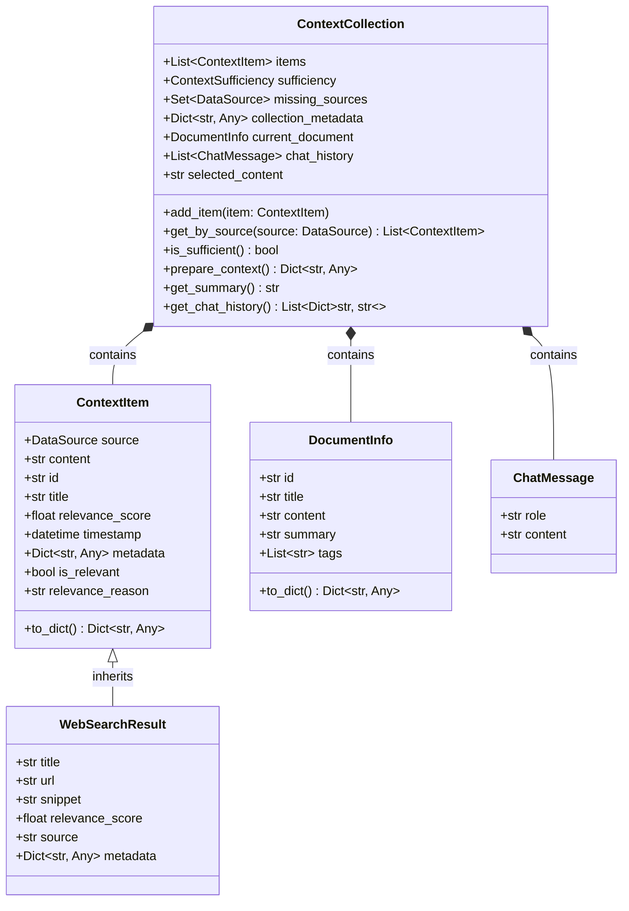
```mermaid
classDiagram
    class ContextCollection {
        +List~ContextItem~ items
        +ContextSufficiency sufficiency
        +Set~DataSource~ missing_sources
        +Dict~str, Any~ collection_metadata
        +DocumentInfo current_document
        +List~ChatMessage~ chat_history
        +str selected_content
        +add_item(item: ContextItem)
        +get_by_source(source: DataSource) List~ContextItem~
        +is_sufficient() bool
        +prepare_context() Dict~str, Any~
        +get_summary() str
        +get_chat_history() List~Dict~str, str~~
    }

    class ContextItem {
        +DataSource source
        +str content
        +str id
        +str title
        +float relevance_score
        +datetime timestamp
        +Dict~str, Any~ metadata
        +bool is_relevant
        +str relevance_reason
        +to_dict() Dict~str, Any~
    }

    class DocumentInfo {
        +str id
        +str title
        +str content
        +str summary
        +List~str~ tags
        +to_dict() Dict~str, Any~
    }

    class ChatMessage {
        +str role
        +str content
    }

    class WebSearchResult {
        +str title
        +str url
        +str snippet
        +float relevance_score
        +str source
        +Dict~str, Any~ metadata
    }

    ContextCollection *-- ContextItem : contains
    ContextCollection *-- DocumentInfo : contains
    ContextCollection *-- ChatMessage : contains
    ContextItem <|-- WebSearchResult : inherits
```

## Intent and Entity Classes

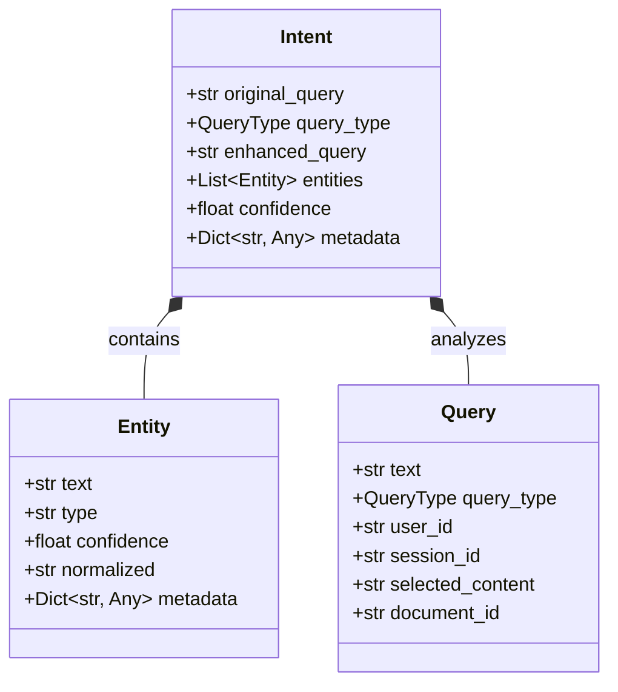
```mermaid
classDiagram
    class Intent {
        +str original_query
        +QueryType query_type
        +str enhanced_query
        +List~Entity~ entities
        +float confidence
        +Dict~str, Any~ metadata
    }

    class Entity {
        +str text
        +str type
        +float confidence
        +str normalized
        +Dict~str, Any~ metadata
    }

    class Query {
        +str text
        +QueryType query_type
        +str user_id
        +str session_id
        +str selected_content
        +str document_id
    }

    Intent *-- Entity : contains
    Intent *-- Query : analyzes
```

## Execution System Classes

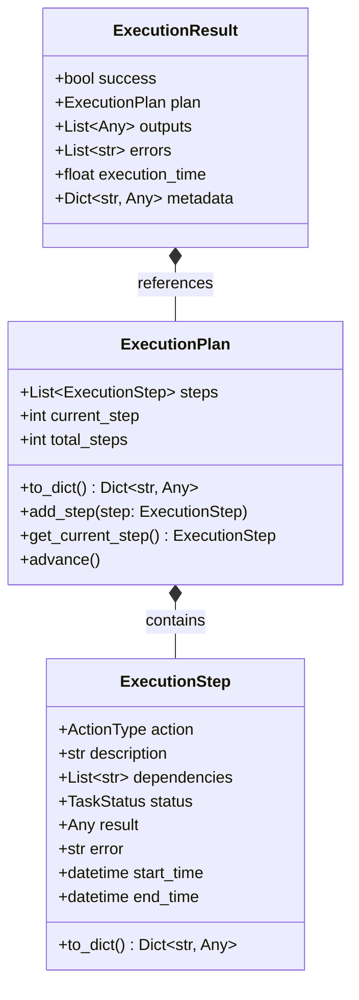
```mermaid
classDiagram
    class ExecutionPlan {
        +List~ExecutionStep~ steps
        +int current_step
        +int total_steps
        +to_dict() Dict~str, Any~
        +add_step(step: ExecutionStep)
        +get_current_step() ExecutionStep
        +advance()
    }

    class ExecutionStep {
        +ActionType action
        +str description
        +List~str~ dependencies
        +TaskStatus status
        +Any result
        +str error
        +datetime start_time
        +datetime end_time
        +to_dict() Dict~str, Any~
    }

    class ExecutionResult {
        +bool success
        +ExecutionPlan plan
        +List~Any~ outputs
        +List~str~ errors
        +float execution_time
        +Dict~str, Any~ metadata
    }

    ExecutionPlan *-- ExecutionStep : contains
    ExecutionResult *-- ExecutionPlan : references
```

## Event System Classes

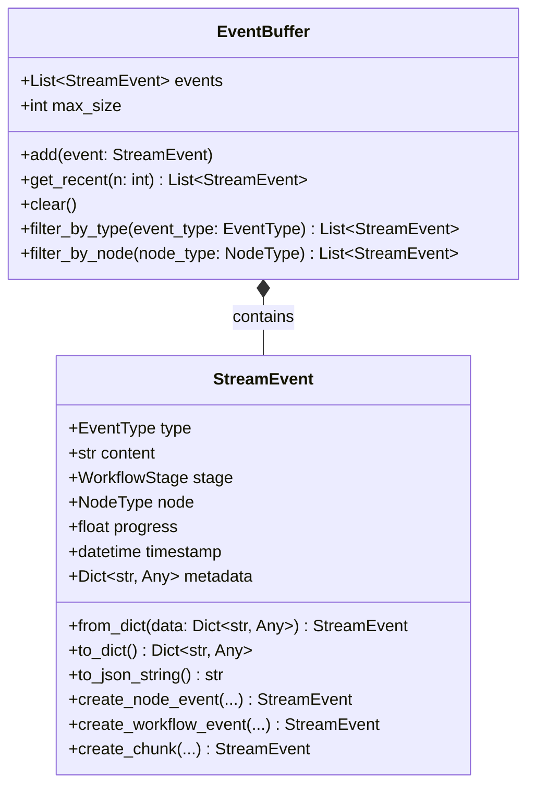
```mermaid
classDiagram
    class EventBuffer {
        +List~StreamEvent~ events
        +int max_size
        +add(event: StreamEvent)
        +get_recent(n: int) List~StreamEvent~
        +clear()
        +filter_by_type(event_type: EventType) List~StreamEvent~
        +filter_by_node(node_type: NodeType) List~StreamEvent~
    }

    class StreamEvent {
        +EventType type
        +str content
        +WorkflowStage stage
        +NodeType node
        +float progress
        +datetime timestamp
        +Dict~str, Any~ metadata
        +from_dict(data: Dict~str, Any~) StreamEvent
        +to_dict() Dict~str, Any~
        +to_json_string() str
        +create_node_event(...) StreamEvent
        +create_workflow_event(...) StreamEvent
        +create_chunk(...) StreamEvent
    }

    EventBuffer *-- StreamEvent : contains
```

## Reflection and Analysis Classes

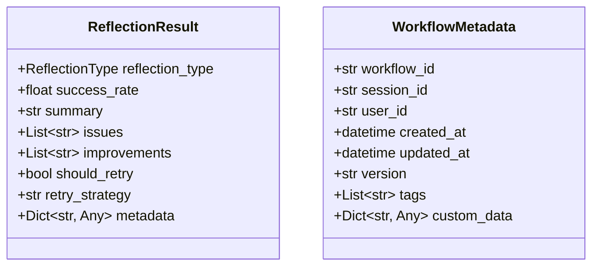
```mermaid
classDiagram
    class ReflectionResult {
        +ReflectionType reflection_type
        +float success_rate
        +str summary
        +List~str~ issues
        +List~str~ improvements
        +bool should_retry
        +str retry_strategy
        +Dict~str, Any~ metadata
    }

    class WorkflowMetadata {
        +str workflow_id
        +str session_id
        +str user_id
        +datetime created_at
        +datetime updated_at
        +str version
        +List~str~ tags
        +Dict~str, Any~ custom_data
    }
```

## Supporting Classes Diagram

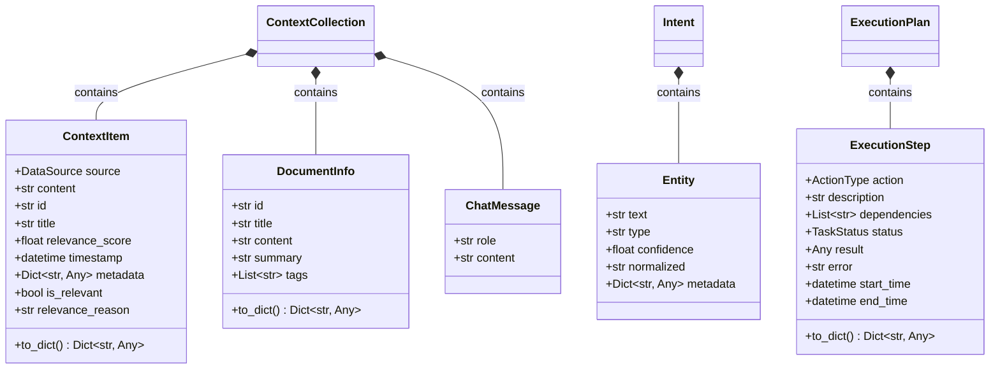
```mermaid
classDiagram
    class ContextItem {
        +DataSource source
        +str content
        +str id
        +str title
        +float relevance_score
        +datetime timestamp
        +Dict~str, Any~ metadata
        +bool is_relevant
        +str relevance_reason
        +to_dict() Dict~str, Any~
    }

    class DocumentInfo {
        +str id
        +str title
        +str content
        +str summary
        +List~str~ tags
        +to_dict() Dict~str, Any~
    }

    class ChatMessage {
        +str role
        +str content
    }

    class Entity {
        +str text
        +str type
        +float confidence
        +str normalized
        +Dict~str, Any~ metadata
    }

    class ExecutionStep {
        +ActionType action
        +str description
        +List~str~ dependencies
        +TaskStatus status
        +Any result
        +str error
        +datetime start_time
        +datetime end_time
        +to_dict() Dict~str, Any~
    }

    ContextCollection *-- ContextItem : contains
    ContextCollection *-- DocumentInfo : contains
    ContextCollection *-- ChatMessage : contains
    Intent *-- Entity : contains
    ExecutionPlan *-- ExecutionStep : contains
```

## Overview

The WorkflowState system is a comprehensive state management framework for AI workflow orchestration. It consists of:

### Core Components
- **WorkflowState**: The main class that manages the entire workflow lifecycle
- **StateManager**: Manages multiple workflow states and provides lifecycle management
- **WorkflowMetadata**: Tracks workflow execution metadata and timestamps

### Functional Areas
- **Context Management**: Handles context collection, storage, and retrieval
  - ContextCollection: Manages multiple context items from various sources
  - ContextItem: Individual context pieces with relevance scoring
  - DocumentInfo: Document metadata and content
  - WebSearchResult: Web search result handling
  - ChatMessage: Chat history management

- **Intent Analysis**: Processes user queries and extracts entities
  - Intent: Query analysis results with enhanced queries
  - Entity: Named entity extraction and recognition
  - Query: User query encapsulation

- **Execution System**: Plans and executes workflow steps
  - ExecutionPlan: Manages execution steps and sequencing
  - ExecutionStep: Individual execution actions with status tracking
  - ExecutionResult: Captures execution outcomes and metrics

- **Event System**: Real-time event streaming and buffering
  - EventBuffer: Manages event streams with filtering capabilities
  - StreamEvent: Unified event structure for all workflow events

- **Reflection and Analysis**: Post-execution analysis and improvement suggestions
  - ReflectionResult: Captures analysis and improvement recommendations

### Type System
- **Enumerations**: Type-safe enums for workflow stages, query types, and other constants
  - WorkflowStage, QueryType, ContextSufficiency, ReflectionType
  - EventType, NodeType, DataSource, ActionType, TaskStatus

The system follows a clear separation of concerns with well-defined interfaces and comprehensive error handling capabilities. Each functional area is modular and can be extended independently while maintaining coherent integration through the central WorkflowState orchestrator.

## Key Corrections Made to Sequence Diagrams

Based on the actual code analysis in `workflow.py`, the following corrections were made to ensure accuracy:

1. **Main Workflow Execution**:
   - Added proper stage checking after each node execution (`FAILED` or `COMPLETED` checks)
   - Corrected context sufficiency check (`INSUFFICIENT` check)
   - Removed ReflectionNode from main flow (commented out in code)
   - Fixed the order of operations and return points

2. **Error Handling**:
   - Corrected to show actual error flow in `execute()` method's try-catch block
   - Noted that retry logic exists in state but is not currently implemented in the workflow
   - Removed incorrect retry sequences that don't exist in current code

3. **Reflection Stage**:
   - Marked as "Currently Disabled" to reflect commented-out code
   - Added notes explaining it would work recursively if enabled
   - Corrected the retry logic to match the commented code

4. **Workflow Resume**:
   - Added new sequence based on the actual `resume()` method implementation
   - Included proper handling of `INSUFFICIENT_INFO` stage with user input
   - Added error handling for missing workflows

5. **General Fixes**:
   - Removed references to non-existent `INSUFFICIENT_INFO` workflow stage
   - Corrected the event emission patterns to match actual usage
   - Fixed participant relationships to match actual class structure

# Workflow Sequence Diagrams

## Main Workflow Execution Sequence

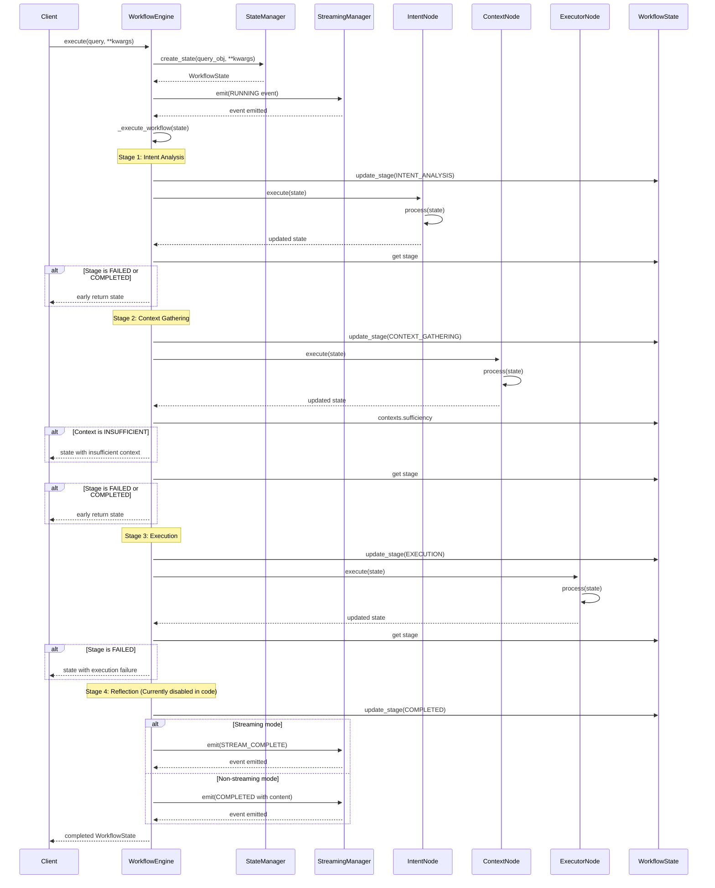
```mermaid
sequenceDiagram
    participant Client
    participant WorkflowEngine
    participant StateManager
    participant StreamingManager
    participant IntentNode
    participant ContextNode
    participant ExecutorNode

    Client->>+WorkflowEngine: execute(query, **kwargs)
    WorkflowEngine->>+StateManager: create_state(query_obj, **kwargs)
    StateManager-->>WorkflowEngine: WorkflowState
    WorkflowEngine->>+StreamingManager: emit(RUNNING event)
    StreamingManager-->>WorkflowEngine: event emitted
    WorkflowEngine->>WorkflowEngine: _execute_workflow(state)

    Note over WorkflowEngine: Stage 1: Intent Analysis
    WorkflowEngine->>WorkflowState: update_stage(INTENT_ANALYSIS)
    WorkflowEngine->>+IntentNode: execute(state)
    IntentNode->>IntentNode: process(state)
    IntentNode-->>WorkflowEngine: updated state

    WorkflowEngine->>WorkflowState: get stage
    alt Stage is FAILED or COMPLETED
        WorkflowEngine-->>Client: early return state
    end

    Note over WorkflowEngine: Stage 2: Context Gathering
    WorkflowEngine->>WorkflowState: update_stage(CONTEXT_GATHERING)
    WorkflowEngine->>+ContextNode: execute(state)
    ContextNode->>ContextNode: process(state)
    ContextNode-->>WorkflowEngine: updated state

    WorkflowEngine->>WorkflowState: contexts.sufficiency
    alt Context is INSUFFICIENT
        WorkflowEngine-->>Client: state with insufficient context
    end

    WorkflowEngine->>WorkflowState: get stage
    alt Stage is FAILED or COMPLETED
        WorkflowEngine-->>Client: early return state
    end

    Note over WorkflowEngine: Stage 3: Execution
    WorkflowEngine->>WorkflowState: update_stage(EXECUTION)
    WorkflowEngine->>+ExecutorNode: execute(state)
    ExecutorNode->>ExecutorNode: process(state)
    ExecutorNode-->>WorkflowEngine: updated state

    WorkflowEngine->>WorkflowState: get stage
    alt Stage is FAILED
        WorkflowEngine-->>Client: state with execution failure
    end

    Note over WorkflowEngine: Stage 4: Reflection (Currently disabled in code)
    WorkflowEngine->>WorkflowState: update_stage(COMPLETED)

    alt Streaming mode
        WorkflowEngine->>StreamingManager: emit(STREAM_COMPLETE)
        StreamingManager-->>WorkflowEngine: event emitted
    else Non-streaming mode
        WorkflowEngine->>StreamingManager: emit(COMPLETED with content)
        StreamingManager-->>WorkflowEngine: event emitted
    end
    WorkflowEngine-->>Client: completed WorkflowState
```

## Intent Analysis Sequence

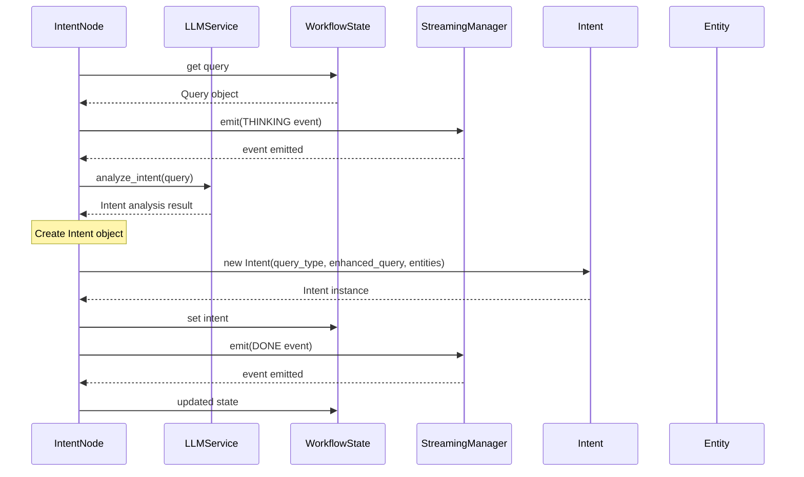
```mermaid
sequenceDiagram
    participant IntentNode
    participant LLMService
    participant WorkflowState
    participant StreamingManager
    participant Intent
    participant Entity

    IntentNode->>WorkflowState: get query
    WorkflowState-->>IntentNode: Query object
    IntentNode->>StreamingManager: emit(THINKING event)
    StreamingManager-->>IntentNode: event emitted
    IntentNode->>LLMService: analyze_intent(query)
    LLMService-->>IntentNode: Intent analysis result

    Note over IntentNode: Create Intent object
    IntentNode->>Intent: new Intent(query_type, enhanced_query, entities)
    Intent-->>IntentNode: Intent instance
    IntentNode->>WorkflowState: set intent
    IntentNode->>StreamingManager: emit(DONE event)
    StreamingManager-->>IntentNode: event emitted
    IntentNode->>WorkflowState: updated state
```

## Context Gathering Sequence

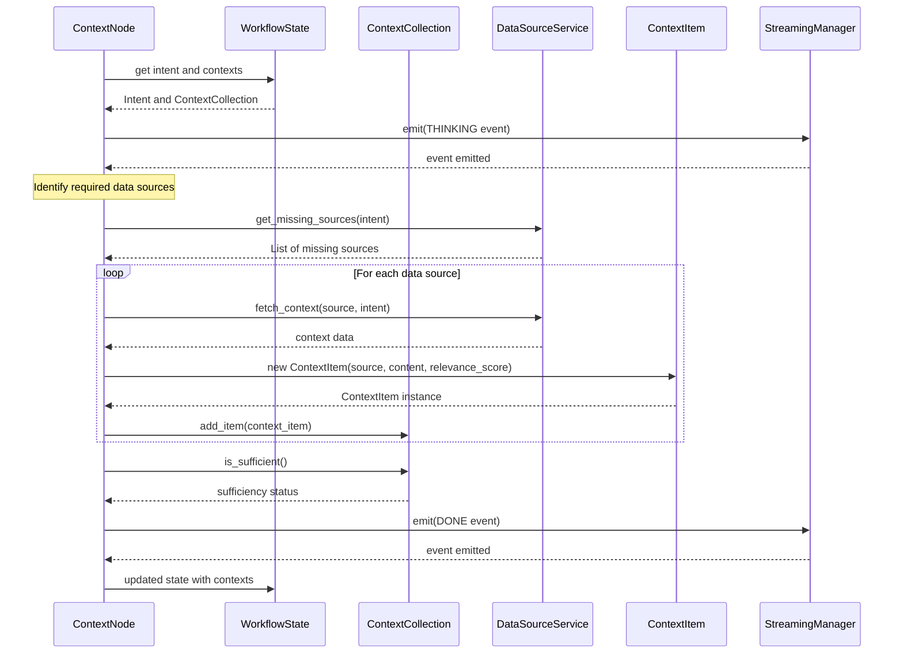
```mermaid
sequenceDiagram
    participant ContextNode
    participant WorkflowState
    participant ContextCollection
    participant DataSourceService
    participant ContextItem
    participant StreamingManager

    ContextNode->>WorkflowState: get intent and contexts
    WorkflowState-->>ContextNode: Intent and ContextCollection
    ContextNode->>StreamingManager: emit(THINKING event)
    StreamingManager-->>ContextNode: event emitted

    Note over ContextNode: Identify required data sources
    ContextNode->>DataSourceService: get_missing_sources(intent)
    DataSourceService-->>ContextNode: List of missing sources

    loop For each data source
        ContextNode->>DataSourceService: fetch_context(source, intent)
        DataSourceService-->>ContextNode: context data
        ContextNode->>ContextItem: new ContextItem(source, content, relevance_score)
        ContextItem-->>ContextNode: ContextItem instance
        ContextNode->>ContextCollection: add_item(context_item)
    end

    ContextNode->>ContextCollection: is_sufficient()
    ContextCollection-->>ContextNode: sufficiency status
    ContextNode->>StreamingManager: emit(DONE event)
    StreamingManager-->>ContextNode: event emitted
    ContextNode->>WorkflowState: updated state with contexts
```

## Execution Sequence

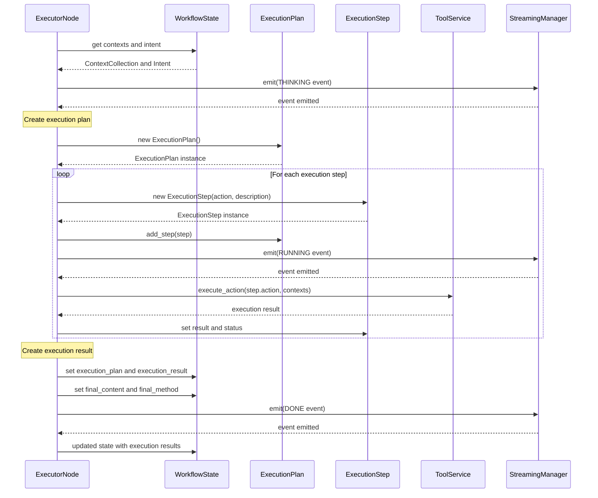
```mermaid
sequenceDiagram
    participant ExecutorNode
    participant WorkflowState
    participant ExecutionPlan
    participant ExecutionStep
    participant ToolService
    participant StreamingManager

    ExecutorNode->>WorkflowState: get contexts and intent
    WorkflowState-->>ExecutorNode: ContextCollection and Intent
    ExecutorNode->>StreamingManager: emit(THINKING event)
    StreamingManager-->>ExecutorNode: event emitted

    Note over ExecutorNode: Create execution plan
    ExecutorNode->>ExecutionPlan: new ExecutionPlan()
    ExecutionPlan-->>ExecutorNode: ExecutionPlan instance

    loop For each execution step
        ExecutorNode->>ExecutionStep: new ExecutionStep(action, description)
        ExecutionStep-->>ExecutorNode: ExecutionStep instance
        ExecutorNode->>ExecutionPlan: add_step(step)

        ExecutorNode->>StreamingManager: emit(RUNNING event)
        StreamingManager-->>ExecutorNode: event emitted
        ExecutorNode->>ToolService: execute_action(step.action, contexts)
        ToolService-->>ExecutorNode: execution result
        ExecutorNode->>ExecutionStep: set result and status
    end

    Note over ExecutorNode: Create execution result
    ExecutorNode->>WorkflowState: set execution_plan and execution_result
    ExecutorNode->>WorkflowState: set final_content and final_method
    ExecutorNode->>StreamingManager: emit(DONE event)
    StreamingManager-->>ExecutorNode: event emitted
    ExecutorNode->>WorkflowState: updated state with execution results
```

## Reflection Sequence (Currently Disabled)

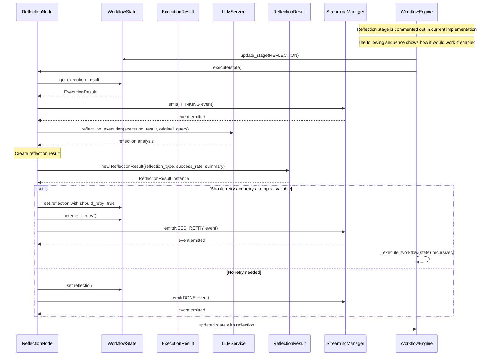
```mermaid
sequenceDiagram
    participant ReflectionNode
    participant WorkflowState
    participant ExecutionResult
    participant LLMService
    participant ReflectionResult
    participant StreamingManager

    Note over WorkflowEngine: Reflection stage is commented out in current implementation
    Note over WorkflowEngine: The following sequence shows how it would work if enabled

    WorkflowEngine->>WorkflowState: update_stage(REFLECTION)
    WorkflowEngine->>ReflectionNode: execute(state)
    ReflectionNode->>WorkflowState: get execution_result
    WorkflowState-->>ReflectionNode: ExecutionResult
    ReflectionNode->>StreamingManager: emit(THINKING event)
    StreamingManager-->>ReflectionNode: event emitted

    ReflectionNode->>LLMService: reflect_on_execution(execution_result, original_query)
    LLMService-->>ReflectionNode: reflection analysis

    Note over ReflectionNode: Create reflection result
    ReflectionNode->>ReflectionResult: new ReflectionResult(reflection_type, success_rate, summary)
    ReflectionResult-->>ReflectionNode: ReflectionResult instance

    alt Should retry and retry attempts available
        ReflectionNode->>WorkflowState: set reflection with should_retry=true
        ReflectionNode->>WorkflowState: increment_retry()
        ReflectionNode->>StreamingManager: emit(NEED_RETRY event)
        StreamingManager-->>ReflectionNode: event emitted
        WorkflowEngine->>WorkflowEngine: _execute_workflow(state) recursively
    else No retry needed
        ReflectionNode->>WorkflowState: set reflection
        ReflectionNode->>StreamingManager: emit(DONE event)
        StreamingManager-->>ReflectionNode: event emitted
    end

    ReflectionNode->>WorkflowEngine: updated state with reflection
```

## Error Handling and Retry Sequence

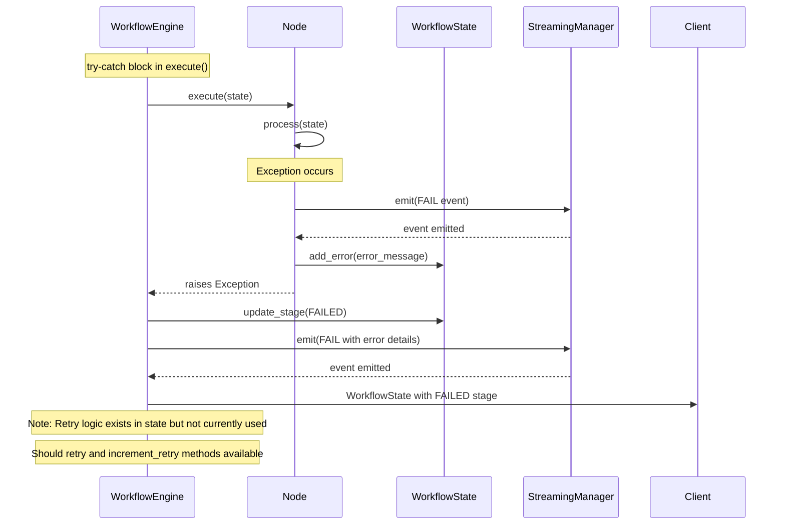
```mermaid
sequenceDiagram
    participant WorkflowEngine
    participant Node
    participant WorkflowState
    participant StreamingManager
    participant Client

    Note over WorkflowEngine: try-catch block in execute()
    WorkflowEngine->>Node: execute(state)
    Node->>Node: process(state)
    Note over Node: Exception occurs
    Node->>StreamingManager: emit(FAIL event)
    StreamingManager-->>Node: event emitted
    Node->>WorkflowState: add_error(error_message)
    Node-->>WorkflowEngine: raises Exception

    WorkflowEngine->>WorkflowState: update_stage(FAILED)
    WorkflowEngine->>StreamingManager: emit(FAIL with error details)
    StreamingManager-->>WorkflowEngine: event emitted
    WorkflowEngine->>Client: WorkflowState with FAILED stage

    Note over WorkflowEngine: Note: Retry logic exists in state but not currently used
    Note over WorkflowEngine: Should retry and increment_retry methods available
```

## Streaming Events Sequence

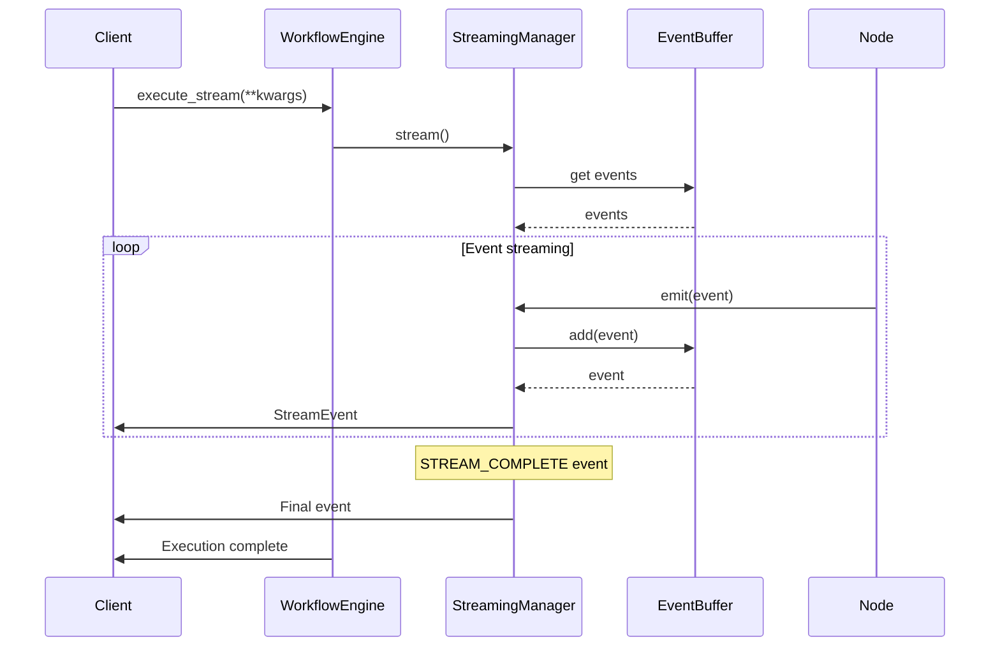
```mermaid
sequenceDiagram
    participant Client
    participant WorkflowEngine
    participant StreamingManager
    participant EventBuffer
    participant Node

    Client->>WorkflowEngine: execute_stream(**kwargs)
    WorkflowEngine->>StreamingManager: stream()
    StreamingManager->>EventBuffer: get events
    EventBuffer-->>StreamingManager: events

    loop Event streaming
        Node->>StreamingManager: emit(event)
        StreamingManager->>EventBuffer: add(event)
        EventBuffer-->>StreamingManager: event
        StreamingManager->>Client: StreamEvent
    end

    Note over StreamingManager: STREAM_COMPLETE event
    StreamingManager->>Client: Final event
    WorkflowEngine->>Client: Execution complete
```

## State Management Sequence

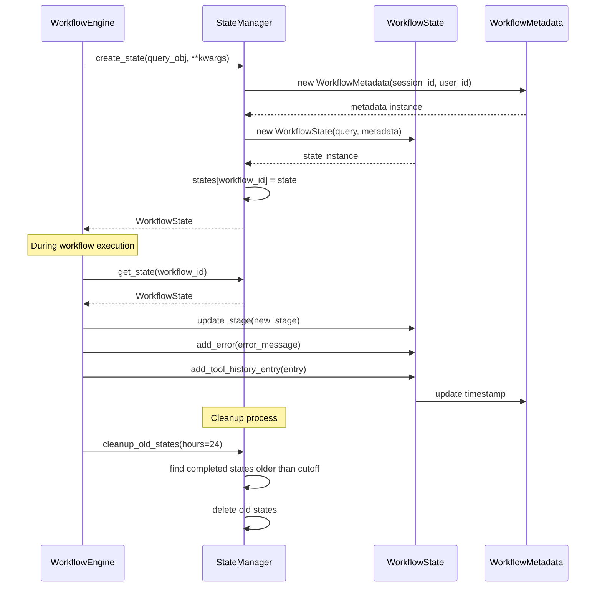
```mermaid
sequenceDiagram
    participant WorkflowEngine
    participant StateManager
    participant WorkflowState
    participant WorkflowMetadata

    WorkflowEngine->>StateManager: create_state(query_obj, **kwargs)
    StateManager->>WorkflowMetadata: new WorkflowMetadata(session_id, user_id)
    WorkflowMetadata-->>StateManager: metadata instance
    StateManager->>WorkflowState: new WorkflowState(query, metadata)
    WorkflowState-->>StateManager: state instance
    StateManager->>StateManager: states[workflow_id] = state
    StateManager-->>WorkflowEngine: WorkflowState

    Note over WorkflowEngine: During workflow execution
    WorkflowEngine->>StateManager: get_state(workflow_id)
    StateManager-->>WorkflowEngine: WorkflowState
    WorkflowEngine->>WorkflowState: update_stage(new_stage)
    WorkflowEngine->>WorkflowState: add_error(error_message)
    WorkflowEngine->>WorkflowState: add_tool_history_entry(entry)
    WorkflowState->>WorkflowMetadata: update timestamp

    Note over StateManager: Cleanup process
    WorkflowEngine->>StateManager: cleanup_old_states(hours=24)
    StateManager->>StateManager: find completed states older than cutoff
    StateManager->>StateManager: delete old states
```

## Workflow Resume Sequence

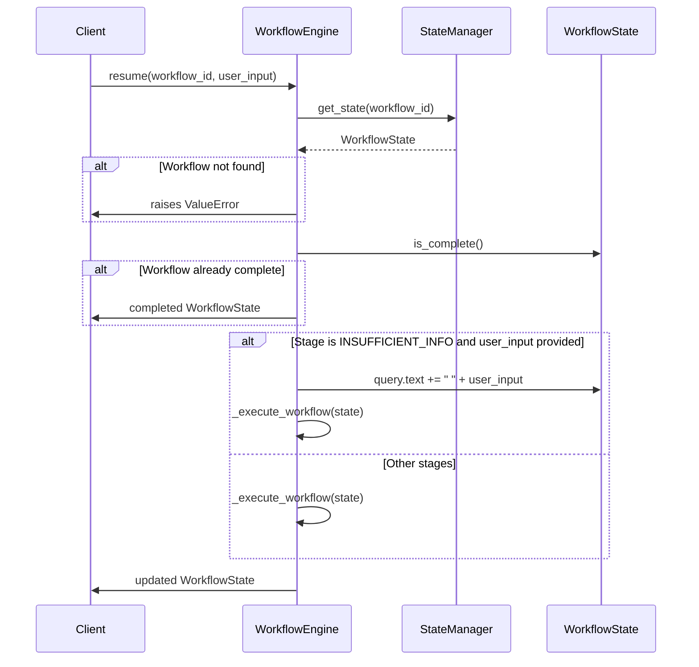
```mermaid
sequenceDiagram
    participant Client
    participant WorkflowEngine
    participant StateManager
    participant WorkflowState

    Client->>WorkflowEngine: resume(workflow_id, user_input)
    WorkflowEngine->>StateManager: get_state(workflow_id)
    StateManager-->>WorkflowEngine: WorkflowState

    alt Workflow not found
        WorkflowEngine->>Client: raises ValueError
    end

    WorkflowEngine->>WorkflowState: is_complete()
    alt Workflow already complete
        WorkflowEngine->>Client: completed WorkflowState
    end

    alt Stage is INSUFFICIENT_INFO and user_input provided
        WorkflowEngine->>WorkflowState: query.text += " " + user_input
        WorkflowEngine->>WorkflowEngine: _execute_workflow(state)
    else Other stages
        WorkflowEngine->>WorkflowEngine: _execute_workflow(state)
    end

    WorkflowEngine->>Client: updated WorkflowState
```