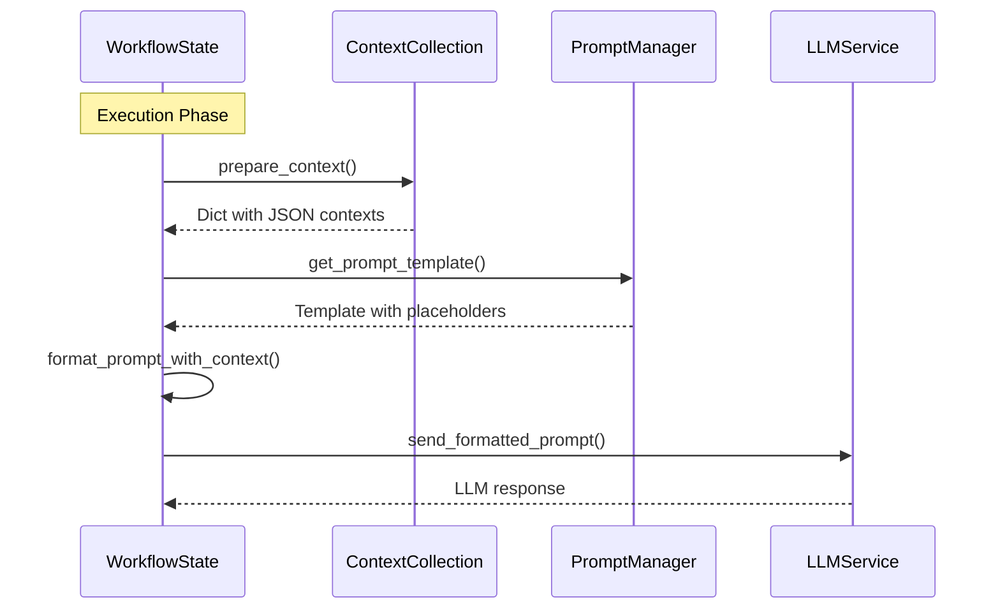

# WorkflowState to Prompt Transformation

This document explains how the WorkflowState object is systematically transformed into prompts for LLM consumption at different stages of the workflow.

## Overview

The WorkflowState transformation process involves converting structured workflow data into natural language prompts that LLMs can understand and process. This happens at multiple points in the workflow, primarily during intent analysis, context gathering, and execution phases.

## Transformation Process Flow



## Key Transformation Components

### 1. ContextCollection.prepare_context() Method

**Location**: `opencontext/context_consumption/context_agent/models/schemas.py:144-163`

This is the core transformation method that converts the structured context into LLM-consumable format:

```python
def prepare_context(self) -> Dict[str, Any]:
    """Prepare execution context, optimize loading strategy based on query_type"""
    context = {}

    # Convert ChatMessage objects to JSON format
    chat_history_dicts = [asdict(msg) for msg in self.chat_history]
    context["chat_history"] = json.dumps(chat_history_dicts, ensure_ascii=False)

    # Serialize current document if present
    if self.current_document:
        context["current_document"] = json.dumps(
            self.current_document.to_dict(), ensure_ascii=False
        )

    # Add selected content
    if self.selected_content:
        context["selected_content"] = self.selected_content or ""

    # Convert context items to JSON array
    if self.items:
        context["collected_contexts"] = json.dumps(
            [item.to_dict() for item in self.items], ensure_ascii=False
        )

    return context
```

### 2. Prompt Template System

**Location**: `config/prompts_en.yaml`

The system uses structured prompt templates with placeholders that get populated with WorkflowState data:

```yaml
chat_workflow:
  executor:
    generate:
      system: |
        You are a content generation assistant. Generate accurate, structured content based on user needs and context.
      user: |
        User query: {query}
        Optimized query: {enhanced_query}
        Collected context: {collected_contexts}
        Chat history: {chat_history}
        Current document: {current_document}
        Selected content: {selected_content}
```

### 3. Execution Node Prompt Formatting

**Location**: `opencontext/context_consumption/context_agent/nodes/executor.py:120-140`

The Executor node demonstrates the complete transformation process:

```python
async def _execute_generate(self, state: WorkflowState) -> Dict[str, Any]:
    # Get the prompt template
    prompt_group = get_prompt_group("chat_workflow.executor.generate")
    system_prompt = prompt_group["system"]
    user_prompt = prompt_group["user"]

    # Transform WorkflowState into context dictionary
    context = state.contexts.prepare_context()

    # Format the user prompt with WorkflowState data
    user_prompt = user_prompt.format(
        query=state.intent.original_query,
        enhanced_query=state.intent.enhanced_query,
        collected_contexts=context.get("collected_contexts", ""),
        chat_history=context.get("chat_history", ""),
        current_document=context.get("current_document", ""),
        selected_content=context.get("selected_content", ""),
    )

    # Create LLM messages
    messages = [
        {"role": "system", "content": system_prompt},
        {"role": "user", "content": user_prompt},
    ]

    # Send to LLM
    async for chunk in generate_stream_for_agent(messages):
        # Process streaming response
        ...
```

## Detailed Transformation Steps

### Step 1: Data Serialization

The transformation process begins with serializing complex objects into JSON strings:

1. **ChatMessage Objects**: Converted to dictionaries and JSON string
2. **DocumentInfo**: Serialized using its `to_dict()` method
3. **ContextItem Array**: Each item converted to dictionary and JSON array
4. **Raw Strings**: Passed through directly (selected_content)

### Step 2: Template Population

The serialized data is then used to populate prompt templates:

```python
# Example of populated user prompt
user_prompt = """
User query: "What did I work on yesterday?"
Optimized query: "What tasks and activities did I complete yesterday based on my activity records?"
Collected context: [
  {"id": "123", "source": "timeline", "content": "Completed code review for feature X", "timestamp": "2025-01-12T14:30:00"},
  {"id": "124", "source": "screenshot", "content": "Working on presentation slides", "timestamp": "2025-01-12T16:45:00"}
]
Chat history: [{"role": "user", "content": "What did I work on yesterday?"}]
Current document: ""
Selected content: ""
"""
```

### Step 3: LLM Message Construction

The populated prompts are structured into LLM message format:

```python
messages = [
    {"role": "system", "content": system_prompt},
    {"role": "user", "content": user_prompt},
]
```

## Transformation in Different Workflow Stages

### 1. Intent Analysis Stage

**Location**: `opencontext/context_consumption/context_agent/nodes/intent.py`

Transforms user query and basic context into intent analysis prompts:

```python
# Key transformations:
- Original query → intent analysis prompt
- Chat history → context for understanding
- Entity information → enhancement prompts
- Selected content → specific context
```

### 2. Context Gathering Stage

**Location**: `opencontext/context_consumption/context_agent/core/llm_context_strategy.py`

Transforms intent and existing context into tool selection prompts:

```python
# Key transformations:
- Intent object → tool analysis prompts
- Context summary → sufficiency evaluation prompts
- Tool results → validation prompts
```

### 3. Execution Stage

**Location**: `opencontext/context_consumption/context_agent/nodes/executor.py`

Transforms all collected context into execution prompts:

```python
# Key transformations:
- Complete WorkflowState → formatted execution context
- All context items → JSON context array
- Intent → optimized query for task execution
- Query type → specific execution strategy
```

## Context Summary Generation

The system also creates text summaries of context for different purposes:

```python
def _get_context_summary(self, context: ContextCollection) -> str:
    """Generate text summary for analysis prompts"""
    summary_lines = []

    # Add selected content
    if context.selected_content:
        summary_lines.append(f"Selected Content: {context.selected_content}")

    # Add chat history
    if context.chat_history:
        chat_history = [f"{msg.role}: {msg.content}" for msg in context.chat_history]
        summary_lines.append(f"Chat History: \n" + "\n".join(chat_history))

    # Add context item counts by source
    if context.items:
        sources = {}
        for item in context.items:
            sources[item.source.value] = sources.get(item.source.value, 0) + 1
        summary_lines.append("Collected Context Items:")
        for source, count in sources.items():
            summary_lines.append(f"  - {source}: {count} items")

    return "\n".join(summary_lines)
```

## Transformation Examples

### Example 1: Simple Query Transformation

**Input WorkflowState**:
```python
state.query.text = "What meetings did I have today?"
state.intent.enhanced_query = "What meetings did I attend today according to my calendar and activity records?"
state.contexts.items = [
  ContextItem(source="timeline", content="10:00 AM - Team standup meeting"),
  ContextItem(source="calendar", content="2:00 PM - Project review with stakeholders")
]
```

**Transformed Prompt**:
```
User query: What meetings did I have today?
Optimized query: What meetings did I attend today according to my calendar and activity records?
Collected context: [
  {"source": "timeline", "content": "10:00 AM - Team standup meeting", "timestamp": "..."},
  {"source": "calendar", "content": "2:00 PM - Project review with stakeholders", "timestamp": "..."}
]
Chat history: []
Current document: ""
Selected content: ""
```

### Example 2: Complex Multi-Source Context

**Input WorkflowState** with rich context from multiple sources gets transformed into a comprehensive prompt that includes:
- Timeline data
- Document references
- Chat history context
- Selected text content
- Entity relationships

## Key Benefits of This Transformation Approach

1. **Structured to Natural Language**: Converts structured data into LLM-readable format
2. **Context Preservation**: Maintains all relevant information during transformation
3. **Template-Based**: Ensures consistent prompt structure
4. **Multi-Modal**: Handles text, document, and conversational context
5. **Source Attribution**: Preserves information source metadata
6. **Streaming Ready**: Optimized for streaming LLM responses

## Error Handling and Validation

The transformation process includes several safety measures:

1. **JSON Serialization**: Handles serialization errors gracefully
2. **Null Checks**: Validates presence of optional fields
3. **Fallback Values**: Provides empty strings for missing context
4. **Encoding**: Uses `ensure_ascii=False` for international content

## Performance Considerations

1. **Lazy Evaluation**: Context preparation only when needed
2. **JSON Caching**: Reuses serialized context when possible
3. **Selective Inclusion**: Only includes relevant context sections
4. **Size Limits**: Manages context window constraints

This transformation system enables the WorkflowState to effectively communicate with LLMs while maintaining the rich, structured information collected throughout the workflow process.