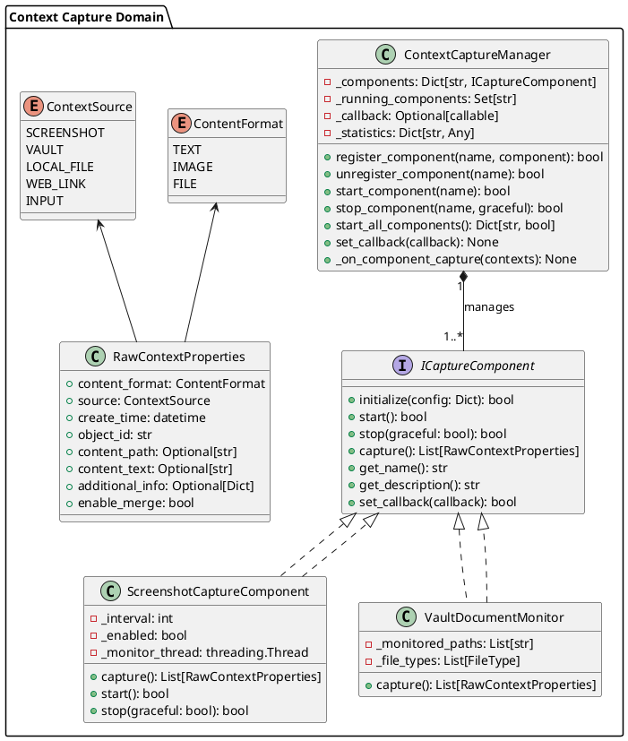
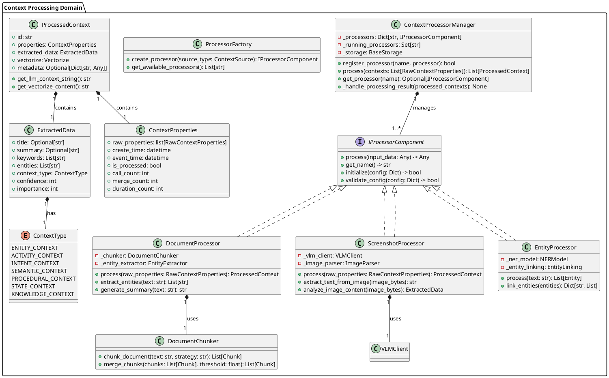
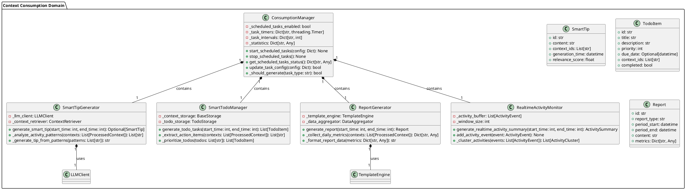
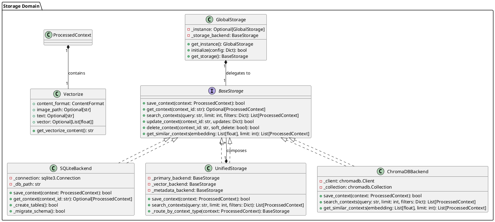
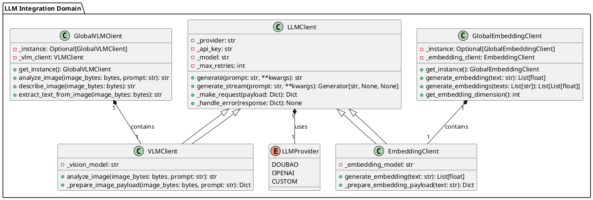
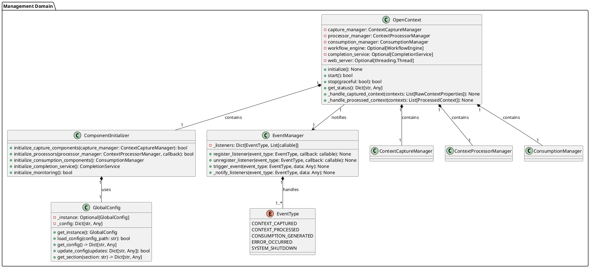
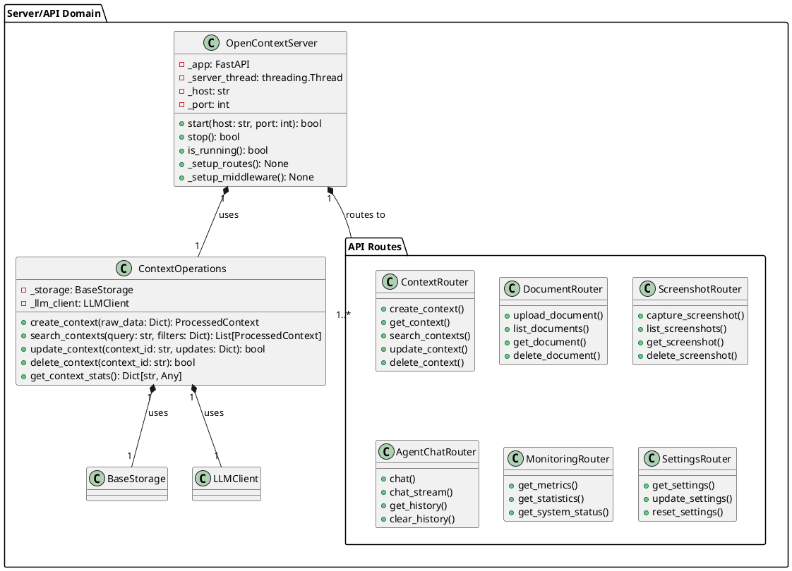
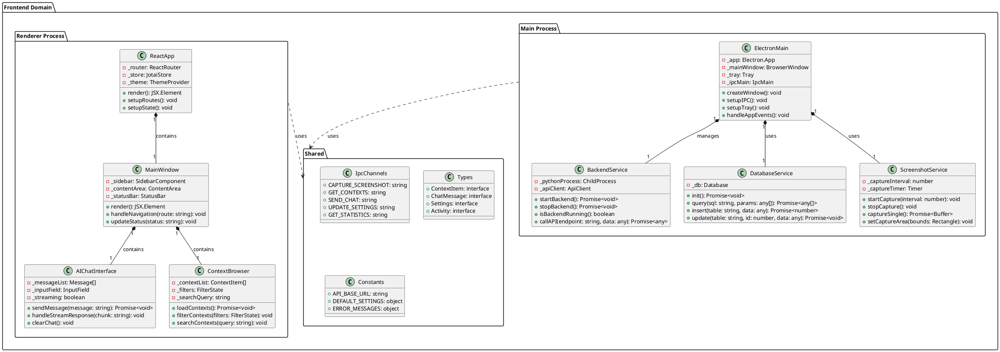

# MineContext Core Domains and Architecture

## Overview

MineContext is a proactive context-aware AI partner that captures, processes, and consumes digital context from multiple sources to generate intelligent insights, summaries, and action items. The system follows a modular, layered architecture with clear separation of concerns.

## Core Domains

Based on the codebase analysis, MineContext is organized into **8 core domains**:

1. **Context Capture Domain** - Data acquisition from multiple sources
2. **Context Processing Domain** - Transformation and enrichment of raw data
3. **Context Consumption Domain** - Generation of value from processed data
4. **Storage Domain** - Multi-backend data persistence
5. **LLM Integration Domain** - AI model orchestration and abstraction
6. **Management Domain** - System coordination and lifecycle management
7. **Server/API Domain** - Web interface and external communication
8. **Frontend Domain** - Desktop application interface

## Domain 1: Context Capture Domain

**Purpose**: Acquire raw context data from various sources (screenshots, documents, files, etc.)

### Key Responsibilities
- Monitor multiple context sources (screenshots, vaults, local files, web links)
- Provide uniform interface for all capture components
- Handle source-specific configurations and lifecycle
- Manage capture scheduling and frequency

### Core Classes



### Relationships
- `ContextCaptureManager` orchestrates multiple `ICaptureComponent` implementations
- Each capture component produces `RawContextProperties` instances
- Components are registered dynamically and managed via lifecycle methods
- Callback system allows decoupled data flow to processing layer

## Domain 2: Context Processing Domain

**Purpose**: Transform raw context data into structured, enriched, and vectorized form

### Key Responsibilities
- Extract semantic information from raw content
- Generate embeddings for similarity search
- Chunk large documents into manageable pieces
- Merge related contexts across sources
- Classify contexts into semantic types

### Core Classes



### Context Classification Types
- **ENTITY_CONTEXT**: Profile information of entities (people, projects, organizations)
- **ACTIVITY_CONTEXT**: Behavioral activities and historical records
- **INTENT_CONTEXT**: Planning and goal information
- **SEMANTIC_CONTEXT**: Knowledge concepts and technical principles
- **PROCEDURAL_CONTEXT**: Operational workflows and task procedures
- **STATE_CONTEXT**: Status monitoring and progress information
- **KNOWLEDGE_CONTEXT**: File-based knowledge content

## Domain 3: Context Consumption Domain

**Purpose**: Generate value-added content from processed contexts through scheduled tasks and AI-driven analysis

### Key Responsibilities
- Generate smart tips based on user activity patterns
- Create to-do items from extracted intents and goals
- Produce daily/weekly activity reports
- Monitor real-time activities and generate summaries
- Schedule and manage automated content generation tasks

### Core Classes



### Scheduled Task Types
1. **Activity Generation**: Real-time activity summaries (default: every 15 minutes)
2. **Smart Tips**: Context-aware suggestions (default: every 1 hour)
3. **Todo Generation**: Actionable task extraction (default: every 30 minutes)
4. **Daily Reports**: Comprehensive daily summaries (configurable time)

## Domain 4: Storage Domain

**Purpose**: Provide unified, multi-backend storage with vector search capabilities

### Key Responsibilities
- Abstract storage backend differences (SQLite, ChromaDB, etc.)
- Manage vector embeddings for semantic search
- Handle CRUD operations for contexts, vaults, and generated content
- Support hybrid storage strategies
- Ensure data consistency and integrity

### Core Classes



### Storage Strategy
- **UnifiedStorage**: Routes data to appropriate backends based on context type
- **SQLiteBackend**: Structured data and metadata storage
- **ChromaDBBackend**: Vector embeddings and similarity search
- **Hybrid approach**: Combines multiple backends for optimal performance

## Domain 5: LLM Integration Domain

**Purpose**: Abstract AI model interactions and provide consistent interfaces for different providers

### Key Responsibilities
- Manage API keys and authentication for multiple providers
- Handle request/response with retry and error handling
- Support both text and vision-language models (VLM)
- Generate high-quality embeddings for vector search
- Provide model-agnostic interfaces

### Core Classes



### Supported Providers
1. **Doubao**: ByteDance's AI models (default recommendation)
2. **OpenAI**: GPT and embedding models
3. **Custom**: Any OpenAI-compatible API endpoint (including local models)

## Domain 6: Management Domain

**Purpose**: Coordinate system components, manage lifecycle, and provide centralized control

### Key Responsibilities
- Initialize and orchestrate all system components
- Manage component dependencies and initialization order
- Handle system-wide configuration
- Provide monitoring and statistics collection
- Coordinate graceful shutdown

### Core Classes



### Initialization Sequence
1. Load configuration via `GlobalConfig`
2. Initialize storage backends
3. Set up LLM clients (embedding and VLM)
4. Register and initialize capture components
5. Set up processor pipeline
6. Initialize consumption generators
7. Start scheduled tasks
8. Launch web server (if enabled)

## Domain 7: Server/API Domain

**Purpose**: Provide HTTP/WebSocket interfaces for external communication and web-based administration

### Key Responsibilities
- Expose RESTful API for context operations
- Serve web interface for debugging and monitoring
- Handle WebSocket connections for real-time updates
- Implement authentication and rate limiting
- Provide admin controls for system configuration

### Core Components



### Key API Endpoints
- `/api/v1/contexts`: CRUD operations for contexts
- `/api/v1/documents`: Document upload and management
- `/api/v1/screenshots`: Screenshot capture and retrieval
- `/api/v1/agent/chat`: AI assistant conversations
- `/api/v1/monitoring`: System metrics and statistics
- `/api/v1/settings`: Configuration management

## Domain 8: Frontend Domain

**Purpose**: Provide cross-platform desktop application interface with native system integration

### Key Responsibilities
- Manage Electron application lifecycle
- Handle system tray and notifications
- Provide React-based user interface
- Integrate with backend APIs via IPC
- Support screen capture and system permissions
- Manage local database and file storage

### Core Components



### Architecture Layers
1. **Main Process**: Node.js/Electron layer for system integration
2. **Renderer Process**: React-based UI layer
3. **Preload Script**: Secure bridge between main and renderer processes
4. **Shared Modules**: Common types, constants, and IPC channels

## System Flow

### 1. Context Capture Flow
```
User Activity → Screenshot Capture → RawContextProperties → CaptureManager Callback
```

### 2. Context Processing Flow
```
RawContextProperties → ProcessorManager → Document/Screenshot Processor → ProcessedContext → Storage
```

### 3. Context Consumption Flow
```
Scheduled Timer → ConsumptionManager → Context Retrieval → AI Generation → Content Storage → UI Update
```

### 4. Query/Response Flow
```
User Query → API/UI → ContextOperations → Storage Search → LLM Processing → Response Generation
```

## Key Design Patterns

### 1. Manager Pattern
Each domain has a manager class that coordinates multiple components:
- `ContextCaptureManager`: Manages capture components
- `ContextProcessorManager`: Coordinates processing pipeline
- `ConsumptionManager`: Orchestrates content generation tasks

### 2. Singleton Pattern
Global services accessible throughout the system:
- `GlobalConfig`: Centralized configuration
- `GlobalStorage`: Unified storage interface
- `GlobalEmbeddingClient`: Shared embedding service

### 3. Factory Pattern
Creates appropriate processors based on context type:
- `ProcessorFactory`: Instantiates document/screenshot processors
- Component factories for different capture sources

### 4. Strategy Pattern
Interchangeable algorithms for different tasks:
- Multiple chunking strategies for documents
- Different merge strategies for context consolidation
- Various search strategies based on query type

### 5. Observer Pattern
Event-driven communication between components:
- `EventManager` for system-wide event notifications
- Callback-based data flow between capture and processing

## Configuration Management

### Configuration Sources (in priority order):
1. Command line arguments (highest priority)
2. Configuration file (`config/config.yaml`)
3. Environment variables
4. Default values

### Key Configuration Sections:
```yaml
server:
  host: 127.0.0.1
  port: 1733

embedding_model:
  provider: doubao
  api_key: your-api-key
  model: doubao-embedding-large-text-240915

vlm_model:
  provider: doubao
  api_key: your-api-key
  model: doubao-seed-1-6-flash-250828

capture:
  enabled: true
  screenshot:
    enabled: true
    capture_interval: 5

content_generation:
  activity:
    enabled: true
    interval: 900  # 15 minutes
  tips:
    enabled: true
    interval: 3600 # 1 hour
  todos:
    enabled: true
    interval: 1800 # 30 minutes
  report:
    enabled: true
    time: "08:00"
```

## Data Models

### Core Data Types:

1. **RawContextProperties**: Raw captured data with source metadata
2. **ProcessedContext**: Enriched context with embeddings and metadata
3. **ExtractedData**: Semantic information extracted from content
4. **Vectorize**: Vector representation for similarity search
5. **ContextProperties**: Temporal and usage metadata

### Context Classification Hierarchy:
```
ContextType (Enum)
├── ENTITY_CONTEXT (9) - People, projects, organizations
├── ACTIVITY_CONTEXT (8) - Actions, events, behaviors
├── INTENT_CONTEXT (7) - Goals, plans, intentions
├── SEMANTIC_CONTEXT (6) - Concepts, knowledge, principles
├── PROCEDURAL_CONTEXT (5) - Processes, workflows, steps
├── STATE_CONTEXT (4) - Status, progress, metrics
└── KNOWLEDGE_CONTEXT (-) - File-based content
```

Numbers in parentheses indicate classification priority.

## Error Handling and Monitoring

### Monitoring Components:
1. **MetricsCollector**: Gathers system performance metrics
2. **Monitor**: Central monitoring coordination
3. **API endpoints**: `/api/v1/monitoring/*`

### Error Recovery Strategies:
1. **Retry with exponential backoff**: For transient API failures
2. **Fallback processors**: Alternative processing strategies
3. **Graceful degradation**: Continue with reduced functionality
4. **Data validation**: Prevent invalid data propagation

## Extension Points

### 1. New Capture Sources
Implement `ICaptureComponent` interface and register with `CaptureManager`

### 2. Custom Processors
Implement `IProcessorComponent` interface and register with `ProcessorManager`

### 3. Additional Storage Backends
Implement `BaseStorage` interface and configure in `UnifiedStorage`

### 4. New LLM Providers
Extend `LLMClient` base class and update provider configuration

### 5. Custom Content Generators
Add new generator classes to `ConsumptionManager` scheduling

## Security Considerations

### 1. Data Privacy
- Local-first data storage by default
- Optional local AI model support
- No data leaves local machine without explicit configuration

### 2. Access Control
- API key management for external services
- Local-only API access by default
- Configurable CORS and authentication

### 3. Input Validation
- Pydantic models for data validation
- Content type verification
- Size and rate limiting

## Performance Considerations

### 1. Caching Strategies
- Embedding cache to avoid redundant API calls
- Context retrieval cache for frequent queries
- Processor result caching

### 2. Batch Processing
- Batch embedding generation
- Bulk context storage operations
- Scheduled task batching

### 3. Resource Management
- Thread pool management for concurrent processing
- Memory usage monitoring and limits
- Database connection pooling

## Deployment Considerations

### 1. Platform Support
- **macOS**: Native application with DMG packaging
- **Windows**: EXE installer with system integration
- **Linux**: AppImage and DEB packages (planned)

### 2. Dependency Management
- **Backend**: uv for Python dependency management
- **Frontend**: pnpm for Node.js dependencies
- **Cross-platform**: Electron for desktop runtime

### 3. Update Mechanism
- Electron auto-updater for application updates
- Backend package updates via package manager
- Configuration migration utilities

## Conclusion

MineContext implements a sophisticated, modular architecture designed for extensibility and maintainability. The eight core domains work together to provide:

1. **Effortless Context Collection**: Multi-source capture with unified interface
2. **Intelligent Processing**: AI-powered enrichment and classification
3. **Proactive Consumption**: Scheduled generation of valuable insights
4. **Flexible Storage**: Multi-backend support with vector search
5. **Extensible Design**: Clean interfaces for custom extensions

The system's local-first approach prioritizes user privacy while providing powerful AI-assisted context management capabilities.