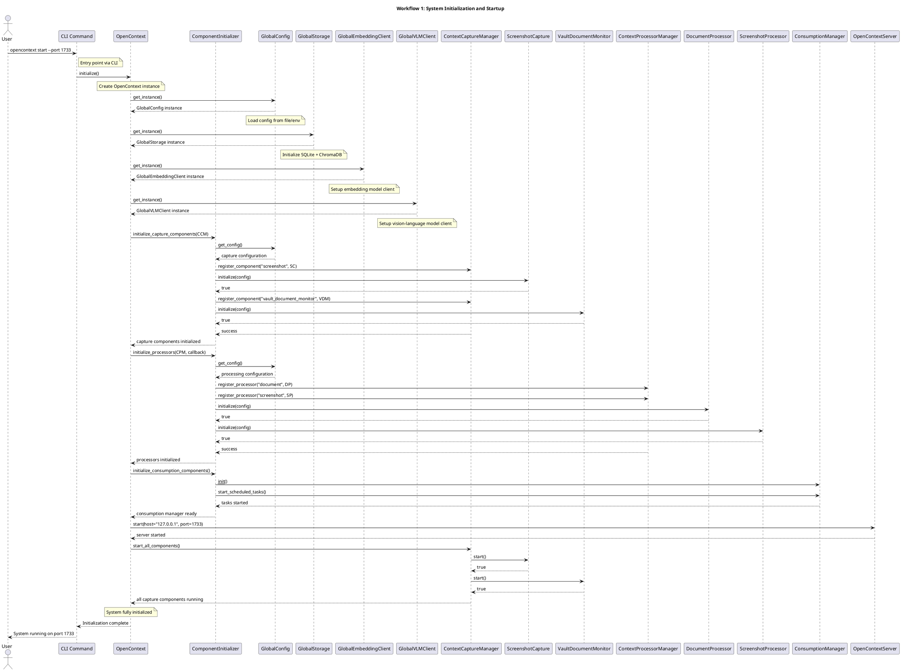
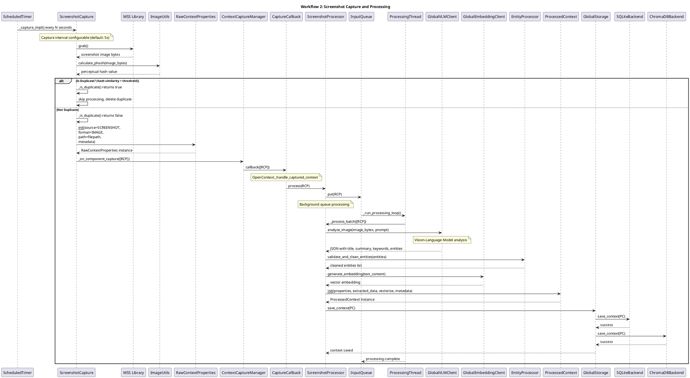
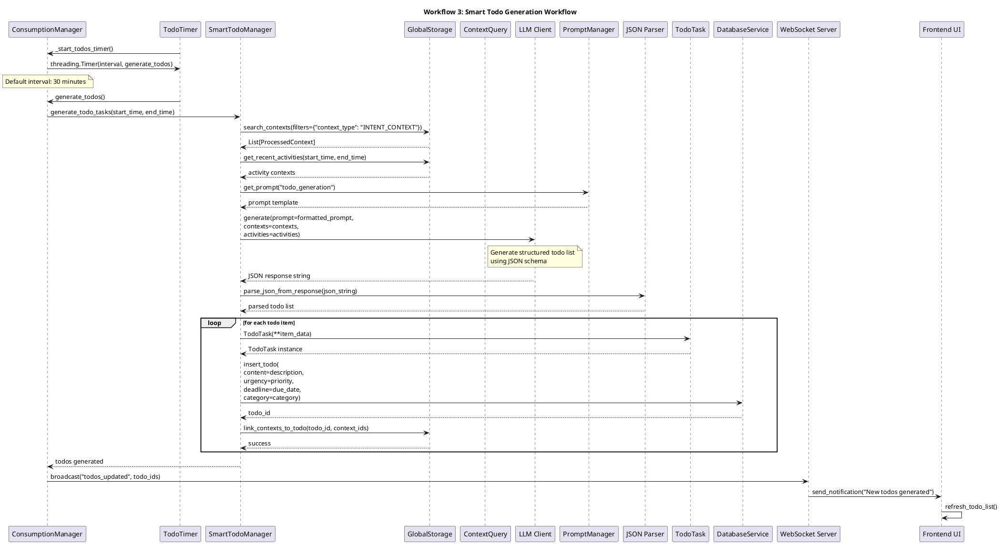
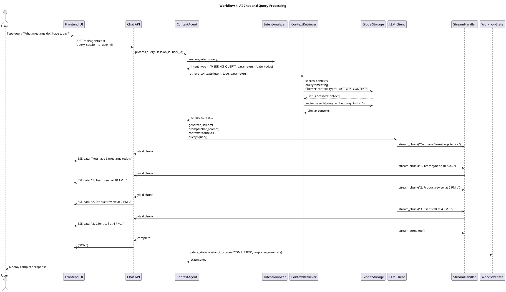
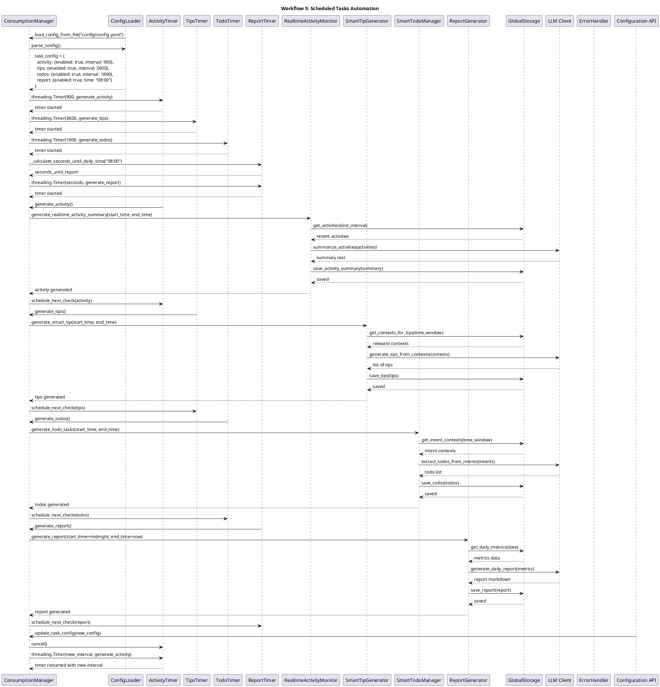

# MineContext Core Workflows Analysis

## Overview

MineContext implements several complex workflows that orchestrate context capture, processing, consumption, and user interaction. This document describes the **5 core workflows** with detailed PlantUML sequence diagrams.

## Workflow 1: System Initialization and Startup

### Purpose
Initialize all system components in the correct order, establish dependencies, and prepare the system for operation.

### Key Steps
1. Load configuration from multiple sources
2. Initialize global services (Config, Storage, LLM Clients)
3. Register and initialize capture components
4. Set up processor pipeline
5. Initialize consumption generators
6. Start scheduled tasks
7. Launch web server (optional)

### Sequence Diagram



### Configuration Loading Priority
1. **Command-line arguments** (highest priority)
2. **Configuration file** (`config/config.yaml`)
3. **Environment variables**
4. **Default values** (lowest priority)

### Component Dependencies
```
GlobalConfig → GlobalStorage → LLM Clients → Capture Components → Processors → Consumption → Server
```

## Workflow 2: Screenshot Capture and Processing

### Purpose
Periodically capture screenshots, deduplicate them, extract semantic information, and store enriched context.

### Key Steps
1. Timer triggers screenshot capture
2. Capture screen image using MSS library
3. Calculate perceptual hash for deduplication
4. Save image to disk (optional)
5. Create RawContextProperties
6. Queue for processing
7. Background processing of screenshot
8. VLM analysis of image content
9. Entity and intent extraction
10. Generate embeddings
11. Store ProcessedContext

### Sequence Diagram



### Real-time Deduplication Process
1. **Perceptual Hash Calculation**: Generate pHash of new screenshot
2. **Similarity Comparison**: Compare with recent screenshot cache
3. **Threshold Check**: If similarity > 95%, skip processing
4. **Cache Management**: Maintain LRU cache of recent screenshots
5. **File Cleanup**: Delete duplicate image files (if enabled)

### VLM Analysis Pipeline
```
Image → Base64 Encoding → Vision Prompt → Doubao VLM → JSON Parsing → ExtractedData
```

## Workflow 3: Context Consumption and Content Generation

### Purpose
Generate valuable insights from collected contexts through scheduled AI-driven analysis.

### Key Steps (Smart Todo Generation Example)
1. ConsumptionManager timer triggers task
2. Retrieve relevant contexts from storage
3. Analyze activity patterns and intents
4. Generate prioritized todo items
5. Validate and clean generated content
6. Store todos in database
7. Update frontend via websocket/push

### Sequence Diagram



### Content Generation Types
1. **Smart Todos**: Extract actionable items from intents (30 min interval)
2. **Smart Tips**: Generate contextual suggestions (1 hour interval)
3. **Activity Reports**: Daily summaries (configurable time)
4. **Real-time Activities**: Continuous activity monitoring (15 min interval)

### Prompt Engineering Flow
```
Context Data → Prompt Template → LLM Generation → JSON Parsing → Content Validation → Storage
```

## Workflow 4: AI Chat and Query Processing

### Purpose
Handle user queries intelligently by retrieving relevant contexts and generating contextual responses.

### Key Steps
1. User sends chat query via API/UI
2. Context Agent processes query
3. Intent analysis and classification
4. Context retrieval based on intent
5. LLM generation with retrieved contexts
6. Streaming response delivery
7. Workflow state management

### Sequence Diagram



### Context Agent Workflow Stages
1. **Intent Analysis**: Classify query type and extract parameters
2. **Context Retrieval**: Fetch relevant contexts using vector + keyword search
3. **Execution Planning**: Determine tools/actions needed
4. **Response Generation**: LLM generation with retrieved contexts
5. **Reflection**: Evaluate response quality and update knowledge

### Hybrid Search Strategy
```
Query → Vector Embedding → Vector Search (ChromaDB)\n+ Keyword Filtering (SQLite) → Reranking → Top-K Contexts
```

## Workflow 5: Scheduled Tasks and Automation

### Purpose
Automatically generate content at configurable intervals without user intervention.

### Key Steps
1. ConsumptionManager initializes scheduled tasks
2. Separate timers for each task type
3. Check if generation conditions are met
4. Execute generation with appropriate time windows
5. Handle failures with retry logic
6. Update configuration dynamically

### Sequence Diagram



### Task Scheduling Details

| Task Type | Default Interval | Purpose | Retry Policy |
|-----------|------------------|---------|--------------|
| Activity | 15 minutes | Real-time activity summaries | 3 retries, exponential backoff |
| Smart Tips | 1 hour | Contextual suggestions | 2 retries, linear backoff |
| Smart Todos | 30 minutes | Actionable task extraction | 3 retries, exponential backoff |
| Daily Report | 24 hours (08:00) | Comprehensive daily summary | Next day retry |

### Failure Handling Strategies
1. **Transient Failures**: Retry with exponential backoff
2. **LLM API Failures**: Fallback to simpler generation
3. **Storage Failures**: Cache and retry later
4. **Configuration Errors**: Use defaults and log warning

## Workflow Integration Points

### Cross-Workflow Dependencies

```
Initialization → Capture → Processing → Storage → Consumption → Chat
      ↓              ↓          ↓          ↓          ↓         ↓
   Config       Screenshot  Deduplication  Vector   Scheduled  Context
   Loading      Timer       & Analysis     Search   Tasks      Retrieval
```

### Data Flow Between Workflows

```
┌─────────────────┐    ┌─────────────────┐    ┌─────────────────┐
│   CAPTURE       │    │   PROCESSING    │    │   CONSUMPTION   │
│   Workflow 2    │───▶│   Workflow 2    │───▶│   Workflow 3    │
│   (Raw Data)    │    │   (Enriched)    │    │   (Insights)    │
└─────────────────┘    └─────────────────┘    └─────────────────┘
         │                       │                       │
         └───────────────────────┼───────────────────────┘
                                 │
                                 ▼
                         ┌─────────────────┐
                         │      CHAT       │
                         │   Workflow 4    │
                         │   (Q/A)         │
                         └─────────────────┘
                                 │
                                 ▼
                         ┌─────────────────┐
                         │    SCHEDULED    │
                         │   Workflow 5    │
                         │   (Automation)  │
                         └─────────────────┘
```

### Critical Path Analysis

**Primary Path** (User activity to insight):
```
Screenshot → Deduplication → VLM Analysis → Embedding → Storage → Scheduled Task → Todo Generation → UI Notification
```

**Query Path** (User question to answer):
```
Chat Query → Intent Analysis → Context Retrieval → LLM Generation → Streaming Response → UI Display
```

### Performance Optimization Points

1. **Capture Workflow**:
   - Perceptual hash caching for faster deduplication
   - Batch processing of screenshots
   - Async file I/O operations

2. **Processing Workflow**:
   - Background thread pooling
   - Batch embedding generation
   - Parallel VLM analysis

3. **Consumption Workflow**:
   - Configurable intervals per task type
   - Incremental context retrieval
   - Cached prompt templates

4. **Chat Workflow**:
   - Vector search with caching
   - Streaming response optimization
   - Session state management

5. **Scheduled Tasks**:
   - Dynamic interval adjustment
   - Failure recovery mechanisms
   - Resource usage monitoring

### Monitoring and Observability

Each workflow includes:
- **Timing metrics** for performance analysis
- **Error tracking** with contextual information
- **Resource usage** monitoring
- **Success/failure rates** for quality assessment
- **Configuration drift** detection

### Configuration Management

Workflows respect configuration hierarchy:
1. **Runtime overrides** (API calls)
2. **Configuration file** (`config/config.yaml`)
3. **Environment variables**
4. **Default values**

Example configuration affecting workflows:
```yaml
# Capture workflow
capture:
  screenshot:
    enabled: true
    capture_interval: 5  # seconds
    dedup_enabled: true
    similarity_threshold: 95

# Processing workflow
processing:
  screenshot_processor:
    batch_size: 10
    batch_timeout: 20  # seconds
    max_raw_properties: 5

# Consumption workflow
content_generation:
  activity:
    enabled: true
    interval: 900  # 15 minutes
  tips:
    enabled: true
    interval: 3600 # 1 hour
  todos:
    enabled: true
    interval: 1800 # 30 minutes
  report:
    enabled: true
    time: "08:00"
```

## Conclusion

The MineContext workflow architecture demonstrates sophisticated orchestration of AI-powered context management:

1. **Initialization Workflow**: Establishes component dependencies and global services
2. **Capture Workflow**: Real-time screenshot monitoring with intelligent deduplication
3. **Processing Workflow**: Multimodal analysis and semantic enrichment
4. **Consumption Workflow**: Scheduled generation of valuable insights
5. **Chat Workflow**: Context-aware intelligent conversation
6. **Scheduled Tasks**: Configurable automation with robust error handling

These workflows interact through well-defined interfaces and data structures, ensuring system reliability while maintaining flexibility for future extensions. The local-first design prioritizes user privacy while leveraging AI capabilities for proactive context management.