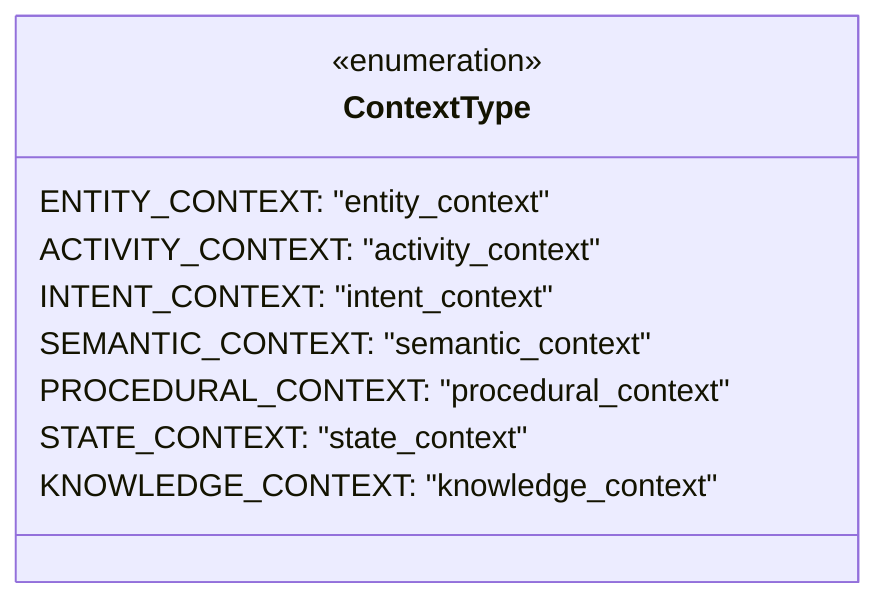
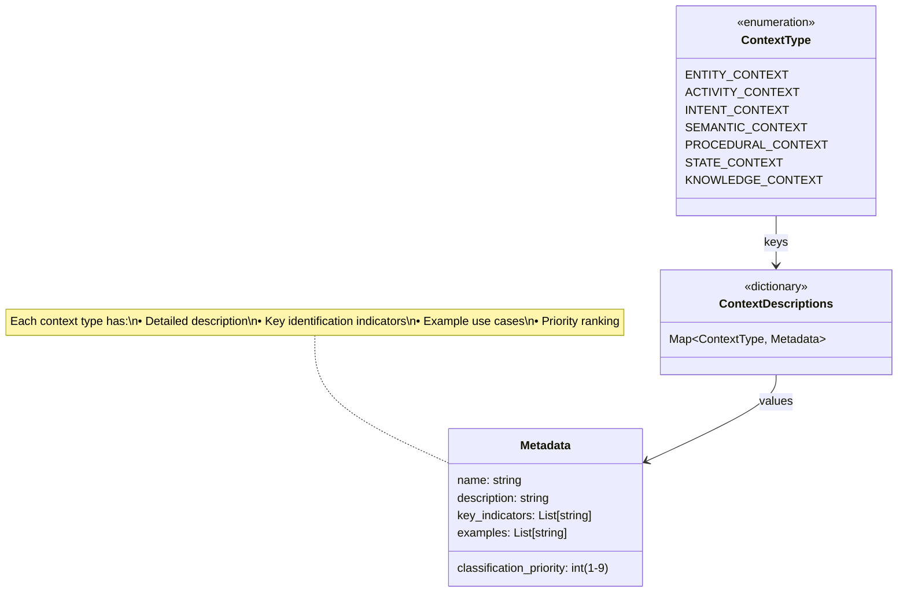
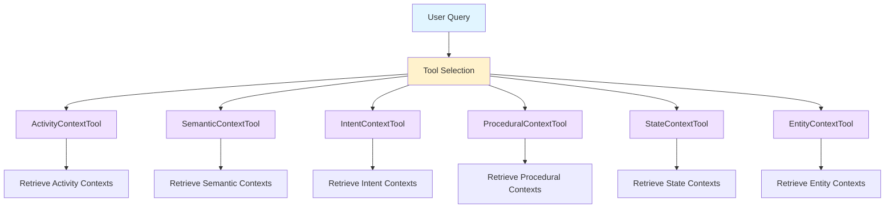
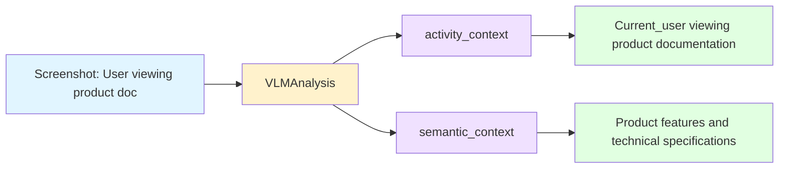
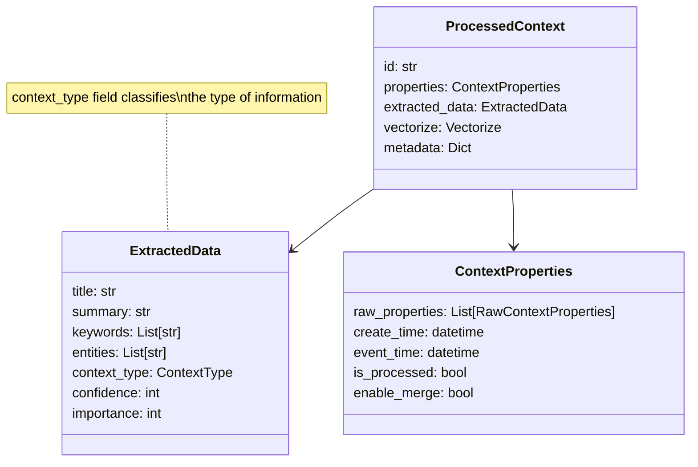

# Context Type System Architecture

This document describes the context type enumeration system used in OpenContext for classifying different types of knowledge and information.

## Overview

The context type system categorizes information into 7 distinct types, each with specific characteristics, identification indicators, and use cases. This classification enables intelligent processing, retrieval, and merging of contextual information.

## Core Components

### 1. ContextType Enum

The `ContextType` enumeration defines the available context types.



**Location**: `opencontext/models/enums.py` (lines 84-100)

**Purpose**: Provides type-safe constants for context classification throughout the codebase.

---

### 2. ContextDescriptions Dictionary

The `ContextDescriptions` dictionary maps each context type to its metadata, including descriptions, identification indicators, examples, and classification priorities.



**Location**: `opencontext/models/enums.py` (lines 144-247)

**Purpose**: Single source of truth for context type metadata, used to generate prompt descriptions and guide LLM classification.

---

### 3. Metadata Structure

Each context type entry in `ContextDescriptions` contains the following fields:

| Field | Type | Description |
|-------|------|-------------|
| `name` | string | The context type value (e.g., "entity_context") |
| `description` | string | Comprehensive description of what this type represents |
| `key_indicators` | List[string] | Identification indicators for classifying content |
| `examples` | List[string] | Sample content for this context type |
| `classification_priority` | int | Priority ranking (9=highest, 4=lowest) |

---

## Context Types in Detail

### ENTITY_CONTEXT
**Purpose**: Entity profile information management

**Answers**: "Who/what is this entity?"

**Use Cases**:
- People profiles and roles
- Project information
- Team/organization structures
- Entity relationships and aliases

**Priority**: 9 (highest)

**Example**:
> Zhang San is a senior development engineer in our project team, specializing in Python and machine learning

---

### ACTIVITY_CONTEXT
**Purpose**: Behavioral activity history records

**Answers**: "What have I done?"

**Use Cases**:
- Completed tasks and operations
- Meeting attendance
- Learning activities
- Communication records

**Priority**: 8

**Example**:
> I attended yesterday's product planning meeting and discussed functional priorities for Q4

---

### INTENT_CONTEXT
**Purpose**: Intent planning and goal records

**Answers**: "What am I going to do?"

**Use Cases**:
- Future plans and roadmaps
- Goal setting
- Action intentions
- Priority planning

**Priority**: 7

**Example**:
> I plan to complete the Python data analysis course next month

---

### SEMANTIC_CONTEXT
**Purpose**: Knowledge concepts and technical principles

**Answers**: "What is this?" and "Why does it work?"

**Use Cases**:
- Technical documentation
- Concept definitions
- System architectures
- Design patterns
- Theoretical principles

**Priority**: 6

**Example**:
> React Hooks principle: enables state and lifecycle features in functional components

---

### PROCEDURAL_CONTEXT
**Purpose**: User operation flows and task procedures

**Answers**: "How to complete this task?"

**Use Cases**:
- Step-by-step workflows
- Reusable operation patterns
- Task completion guides
- Process documentation

**Priority**: 5

**Example**:
> Git merge workflow: Step 1-check status, Step 2-add files, Step 3-commit changes, Step 4-push to remote

---

### STATE_CONTEXT
**Purpose**: Status and progress monitoring records

**Answers**: "How is the progress?"

**Use Cases**:
- Project progress tracking
- Performance metrics
- System status monitoring
- Completion percentages

**Priority**: 4 (lowest)

**Example**:
> The project development progress has been completed by 65% and is expected to be delivered on time

---

### KNOWLEDGE_CONTEXT
**Purpose**: File context

**Use Cases**:
- Document content
- File-based knowledge
- External references

**Note**: This type is defined in the enum but doesn't have detailed metadata in `ContextDescriptions`.

---

## Usage in the System

### Context Type Descriptions for Prompts

The system generates formatted descriptions for inclusion in LLM prompts:

```mermaid
flowchart LR
    A[ContextDescriptions Dict] --> B[get_context_type_descriptions_for_prompts()]
    B --> C[Formatted String]
    C --> D[LLM Prompt]
    D --> E[Context Classification]

    style A fill:#e1f5ff
    style B fill:#fff2cc
    style C fill:#f0e1ff
    style D fill:#ffe1e1
    style E fill:#e1ffe1
```

**Function**: `get_context_type_descriptions_for_prompts()` (lines 293-303)

**Output Format**:
```
*   `entity_context`: Entity profile information management - Record and manage...
*   `activity_context`: Behavioral activity history records - Record the...
*   `intent_context`: Intent planning and goal records - Record an individual's...
*   ...
```

**Usage Location**: `screenshot_processor.py:276-278` - Injected into VLM prompts to guide classification

---

### Context Type Descriptions for Extraction

For content extraction scenarios (screenshots, documents), the system provides enhanced descriptions with key indicators and examples:

```mermaid
flowchart LR
    A[ContextDescriptions Dict] --> B[get_context_type_descriptions_for_extraction()]
    B --> C[Enhanced Format with Indicators & Examples]
    C --> D[Extraction Prompt]
    D --> E[Multi-type Content Extraction]

    style A fill:#e1f5ff
    style B fill:#fff2cc
    style C fill:#f0e1ff
    style D fill:#ffe1e1
    style E fill:#e1ffe1
```

**Function**: `get_context_type_descriptions_for_extraction()` (lines 306-332)

**Output Format**:
```
*   `activity_context`: Behavioral activity history records - ... | Identification indicators: Describes behaviors..., Records participation..., ... | Examples: I attended meeting..., I completed course..., I discussed with...
*   ...
```

---

## Retrieval and Processing

### Specialized Retrieval Tools

Each context type has a dedicated retrieval tool for querying stored contexts:



**Pattern**: Each tool inherits from `BaseContextRetrievalTool` and sets `CONTEXT_TYPE = ContextType.XYZ`

**Example**: `activity_context_tool.py:27`
```python
CONTEXT_TYPE = ContextType.ACTIVITY_CONTEXT
```

---

### Multi-type Extraction

A single screenshot or document can produce multiple context types:



**Principle**: One activity can simultaneously produce multiple context types

**Examples**:
- Viewing product intro → `activity_context` (viewing behavior) + `semantic_context` (product knowledge)
- Viewing task board → `activity_context` (viewing behavior) + `state_context` (task status)
- Configuring service → `activity_context` (operation behavior) + `procedural_context` (process)

---

## Data Models

### ProcessedContext Structure



**Key Field**: `extracted_data.context_type: ContextType` - Classifies the type of information stored

---

## Helper Functions

The system provides several utility functions for working with context types:

### 1. Get Context Type Options
```python
def get_context_type_options() -> List[str]
```
Returns all available context type values as strings.

**Location**: `enums.py:250-252`

---

### 2. Get Context Descriptions
```python
def get_context_descriptions() -> str
def get_context_type_descriptions_for_prompts() -> str
def get_context_type_descriptions_for_extraction() -> str
def get_context_type_descriptions_for_retrieval() -> str
```
Returns formatted descriptions for different use cases.

**Locations**: `enums.py:255-357`

---

### 3. Validate Context Type
```python
def validate_context_type(context_type: str) -> bool
def get_context_type_for_analysis(context_type_str: str) -> ContextType
```
Validates and converts context type strings.

**Locations**: `enums.py:266-282`

---

## Best Practices

### 1. Adding New Context Types

When adding a new context type:

1. Add to `ContextType` enum
2. Add detailed metadata to `ContextDescriptions`
3. Create a corresponding retrieval tool
4. Update extraction prompts if needed
5. Add validation tests

### 2. Using Context Types

**DO**:
- Use the `ContextType` enum for type safety
- Use helper functions to get descriptions
- Handle unknown context types gracefully
- Respect classification priorities in retrieval

**DON'T**:
- Use raw strings instead of enum values
- Hardcode context type descriptions
- Skip validation of context type strings
- Ignore the `classification_priority` field

### 3. Maintaining Consistency

The enum and dictionary should stay in sync. Consider adding a test:

```python
def test_context_type_consistency():
    """Verify all enum values have descriptions"""
    for context_type in ContextType:
        assert context_type in ContextDescriptions, f"Missing description for {context_type}"
```

---

## Summary

The context type system provides:

- **Structured classification** of knowledge into 7 distinct types
- **Rich metadata** for each type (descriptions, indicators, examples, priorities)
- **Type safety** through enum usage
- **Flexible extraction** allowing multiple types from single sources
- **Specialized retrieval** with dedicated tools per context type
- **Intelligent merging** with type-aware logic

This system enables OpenContext to understand, organize, and retrieve contextual information intelligently, providing the foundation for the knowledge management capabilities.
